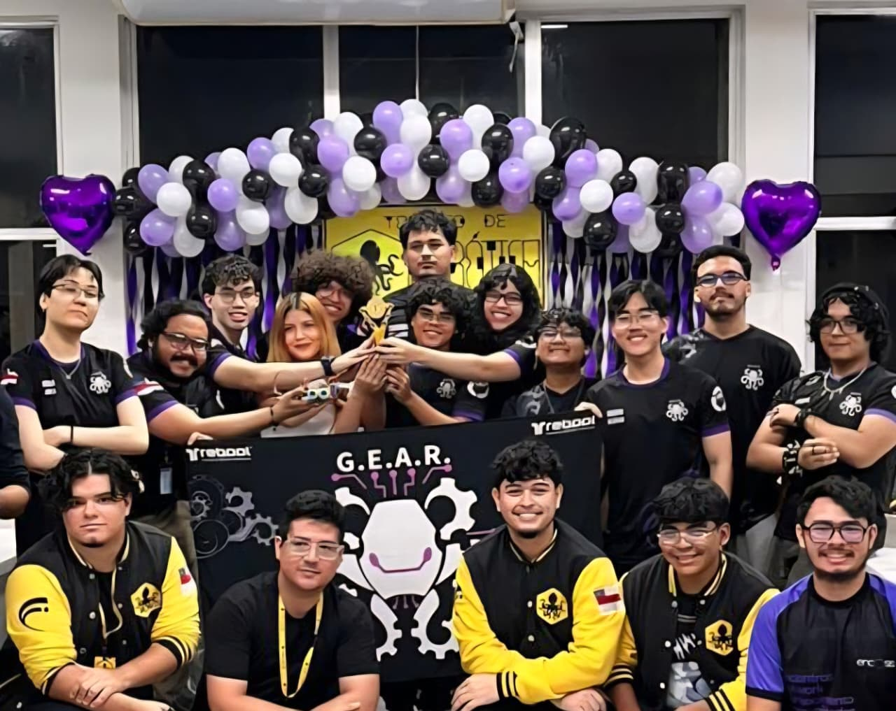

# SEGUIDOR-2026

## Introdução

> "Seguidor de Linha é uma modalidade de competição de robótica que robôs autônomos correm num percurso especificado por uma linha contínua para determinar qual é o mais rápido." -Robocore

Desenvolvido pela equipe universitária da UEA, o [GEAR](https://github.com/GEAR-EST), o objetivo deste projeto é competir na [Robocore Experience](https://www.robocoreexperience.com/), o maior evento de combate de robôs da América Latina, nas categorias Seguidor de Linha (o mais rápido vence) e Perseguidor de Linha (um “pique-pega” de robôs seguidores de linha). A Figura 1 mostra uma imagem do protótipo físico do robô desenvolvido, apelidado de Zé Guia.

**Figura 1:** Visão Geral do Zé Guia

## 1. Bill of Materials (BOM)

Na tabela a seguir será possível observar a lista resumindo os materiais utilizados para a construção do robô:

|                                   | **Bill of Materials - BOM**                                       |               |
|:--:                               |:--:                                                               |:--:	        |
| Nome                              | Explicação                                                        | Quantidade    |
|                                   | **Geral**                                                         |               |
| ESP32 Devkit 30 pinos             | Microcontrolador principal                                        | 1             |
| Placa PCB                         | PCB profissional solicitada pela [JLCPCB](https://jlcpcb.com/)    | 1             |
|                                   | **Alimentação**                                                   |               |
| Bateria LiPo 7,4V 2200mAh 30C     | Bateria de Lipo usada para alimentar o Seguidor                   | 1             |
| Mini-360                          | Regulador de Tensão Step Down para alimentar a ESP                | 1             |
|                                   | **Sensores**                                                      |               |
| Sensor Reflexivo Analógico QTR-8A | Array principal 8 sensores reflexivos                             | 1             |
| Sensor Reflexivo TCRT-5000        | Usado para identificar os indicadores laterais da pista           | 2             |
|                                   | **Movimento**                                                     |               |
| Motor N20 6v 3000RPM              | Motores utilizados para movimentação do robô                      | 2             |
| TB6612FNG                         | Ponte H Dupla para controle dos motores N20                       | 1             |
|                                   | **Turbina**                                                       |               |
| Motor Coreless 8523 7.4V          | Motor utilizado para a turbina                                    | 1             |
| MOSFET IRLZ44N                    | MOSFET utilizado para controle do motor da turbina                | 1             |
| Diodo 1N4007                      | Diodo utilizado para evitar flyback da turbina                    | 1             |

## 2. Modelo 3D

O projeto mecânico do robô foi modelado no software **Autodesk Inventor**, contendo toda a estrutura física necessária para movimento e sucção. O modelo abrange desde os suportes para sensores e motores até a integração com a placa eletrônica, que também atua como chassi. Os arquivos das peças CAD 3D, assembly, arquivos STL, a documentação completa da mecânicapode ser visto no diretório [/mechanics](../mechanics/).

## 3. Eletrônica

A arquitetura eletrônica é centralizada em um microcontrolador **ESP32**, responsável por integrar os sensores de refletância (**QTR-8RC** e **TCRT5000**), acionar os motores N20 via ponte H (**TB6612FNG**) e controlar a turbina de sucção através de um **MOSFET (IRLZ44N)**. Todo o sistema é alimentado por uma bateria LiPo 2S e unificado em uma **PCB de dupla camada**, projetada no **EasyEDA** e fabricada pela JLCPCB. O esquemático completo, diagramas de pinout e a evolução do hardware estão documentados no diretório [/electronics](../electronics/).

## 4. Lógica do robô

O firmware do robô foi desenvolvido sob o framework **Arduino** utilizando **FreeRTOS** no ambiente de desenvolvimento **PlatformIO**. O sistema aproveita o processamento *dual-core* da ESP32 para executar duas *Tasks* paralelas: uma dedicada exclusivamente à comunicação Bluetooth e telemetria, e outra focada no processamento em tempo real do controle **PID** e leitura de sensores. A lógica principal é regida por uma Máquina de Estados (FSM) que gerencia os modos de corrida e estratégias do robô. A documentação completa da arquitetura do código está no diretório [/code](../code/).

## 5. Interface de Controle

O robô é controlado remotamente pelo **ZeGuiaApp**, um aplicativo Android nativo desenvolvido em **Kotlin**, que se comunica com a ESP32 via **Bluetooth Classic (SPP/RFCOMM)**. O app permite ao operador calibrar os sensores, selecionar modo e estratégia, ajustar os parâmetros PID, iniciar e finalizar corridas, monitorar a leitura dos sensores em tempo real e exportar um resumo de performance ao final de cada corrida. A documentação completa da interface está em [/interface/](../interface).

## 6. Resultados

Como resultados, tivemos:

1. **1° Lugar na Competição de Robótica da FUCAPI 2026**

