# Diretório de Eletrônica

Este diretório contém todos as informações relacionados ao desenvolvimento eletrônico do robô seguidor de linha do projeto *SEGUIDOR-2026*.

Aqui estão reunidos os diagramas de conexão, pinouts dos componentes, imagens da placa de circuito impresso (PCB) e outros arquivos necessários para documentar o desenvolvimento da eletrônica do robô.

O objetivo deste diretório é facilitar a compreensão da arquitetura eletrônica do sistema, bem como registrar a evolução do projeto ao longo do desenvolvimento.

## Visão Geral da Eletrônica

O sistema eletrônico do robô é baseado em um microcontrolador ESP32, responsável por processar as informações obtidas pelos sensores e controlar os atuadores do robô.

O robô utiliza um sensor principal de linha (QTR-8RC) para detectar a pista, além de sensores laterais infravermelhos que auxiliam na identificação de limites da pista e marcações ao longo do percurso.

A movimentação do robô é realizada por dois motores DC N20, controlados por uma ponte H TB6612FNG, que recebe sinais de controle do ESP32 permitindo controlar a velocidade e o sentido de rotação dos motores.

Além do sistema de locomoção, o robô também possui um motor coreless utilizado como ventoinha de sucção. Esse motor é acionado através de um MOSFET controlado pelo microcontrolador.

A alimentação do sistema é fornecida por uma bateria LiPo, sendo distribuída para os diferentes componentes do circuito por meio de um regulador de tensão e da própria arquitetura da placa eletrônica.

## Arquitetura do Sistema

A alimentação do sistema é fornecida por uma bateria LiPo 2S de 7,4 V. A energia proveniente da bateria é distribuída para diferentes partes do circuito de acordo com a necessidade de cada componente.

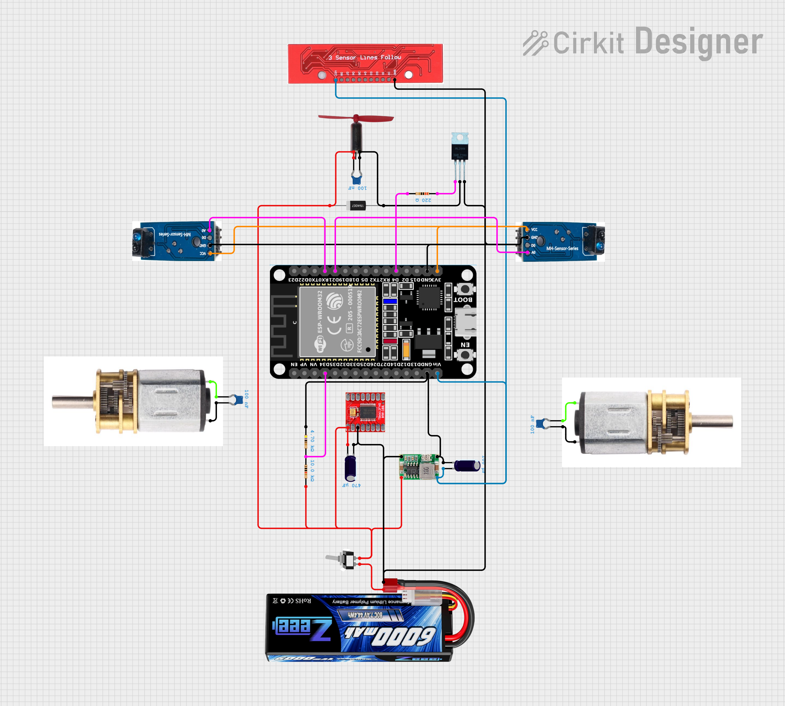

A tensão da bateria é direcionada para três partes principais do sistema:

- Regulador de tensão Mini360
- Ponte H TB6612FNG (pino VM)
- Motor coreless responsável pelo sistema de sucção

O regulador de tensão Mini360 é responsável por reduzir a tensão da bateria para um nível adequado para o funcionamento do microcontrolador ESP32.

O ESP32 atua como unidade central de processamento do robô, sendo responsável pela leitura dos sensores e pelo controle dos atuadores. A partir do ESP32 é fornecida a alimentação de *3.3 V* para os sensores do sistema, incluindo o sensor principal *QTR-8RC, utilizado para detecção da linha da pista, e os sensores laterais **TCRT5000*, utilizados para detecção auxiliar durante a navegação do robô.

A ponte H TB6612FNG utiliza a tensão da bateria em seu pino VM para fornecer energia aos motores N20 responsáveis pela locomoção do robô. O controle da velocidade e do sentido de rotação dos motores é realizado através de sinais PWM enviados pelo ESP32.

O motor coreless utilizado no sistema de sucção é controlado através de um transistor MOSFET IRLZ44N acionado pelo ESP32. Para proteger o circuito contra picos de tensão gerados pelo motor, é utilizado um diodo de flyback conectado em paralelo com o motor.

Em relação ao sistema de aterramento, a placa de circuito impresso (PCB) fabricada por processo industrial utiliza um plano de terra (GND plane), permitindo que todos os componentes compartilhem uma referência comum de aterramento distribuída pela própria placa. Já em versões de prototipagem fabricadas em CNC, o aterramento é realizado através de trilhas de GND conectando diretamente os componentes do circuito.

## Componentes Utilizados

| Componente | Qtd | Descrição |
|-------------|-----|-----------|
| ESP32 Dev Kit | 1 | Microcontrolador principal do sistema. Foi escolhido por possuir alto poder de processamento, baixo custo, conectividade Bluetooth e dois núcleos que permitem processamento em paralelo. |
| TB6612FNG | 1 | Ponte H utilizada para controle dos dois motores N20. Possui boa precisão nos comandos PWM, corrente nominal compatível com os motores utilizados e boa integração com a ESP32. |
| Array sensor de linha QTR-8RC | 1 | Sensor principal do projeto. Consiste em um array de 8 sensores de refletância infravermelho de alta precisão ideal para robôs seguidores de linha. Possui biblioteca dedicada que facilita o desenvolvimento do algoritmo de controle. |
| Módulo sensor infravermelho TCRT5000 | 2 | Sensores de refletância infravermelho utilizados para detecção de linhas laterais e marcações de início ou fim de percurso. |
| Bateria LiPo 2S 7,4 V 20C 250 mAh | 1 | Fonte principal de alimentação do sistema. Baterias LiPo são capazes de fornecer altas correntes de descarga necessárias para o funcionamento dos motores. |
| Motor N20 3000 RPM | 2 | Motores responsáveis pela locomoção do robô. São motores compactos com alta rotação e torque adequado para aplicações em robôs seguidores de linha. |
| Motor coreless 8523 (7,4 V) | 1 | Motor utilizado no sistema de sucção. Motores coreless são capazes de atingir altas rotações com baixo peso, sendo amplamente utilizados em drones. |
| MOSFET IRLZ44N | 1 | Transistor utilizado para acionamento do motor coreless. Permite controlar a turbina de sucção através de sinais da ESP32. |
| Diodo 1N4007 | 1 | Diodo de flyback utilizado para proteger o MOSFET contra picos de tensão reversos gerados pelo motor. |
| Regulador de tensão Mini360 | 1 | Conversor DC-DC do tipo buck utilizado para reduzir a tensão da bateria para níveis adequados de alimentação da ESP32. |
| Switch 3 vias | 1 | Chave utilizada para ligar e desligar o sistema. |
| Capacitor cerâmico 100 nF | 4 | Capacitores utilizados para desacoplamento e filtragem de ruído de alta frequência. |
| Capacitor eletrolítico 47 µF | 1 | Capacitor utilizado para estabilização da alimentação e absorção de picos de corrente. |
| Resistor 220 Ω | 1 | Resistor utilizado entre o pino de controle da ESP32 e a porta do MOSFET. |
| Resistor 10 kΩ | 1 | Resistor utilizado no divisor de tensão para monitoramento da bateria. |
| Resistor 4,7 kΩ | 1 | Resistor utilizado no divisor de tensão para monitoramento da bateria. |
| Barra de pinos fêmea 1x40 vias | 1 | Utilizada para conexão da ponte H e da ESP32. |
| Barra de pinos macho 1x40 vias | 1 | Utilizada para conexão de sensores e motores. |

# Pinouts dos Componentes

Nesta seção são apresentados os diagramas de pinout dos principais componentes do sistema eletrônico. Esses diagramas ajudam a visualizar como os pinos de cada componente estão conectados dentro do circuito do robô.

### ESP32 Dev Kit

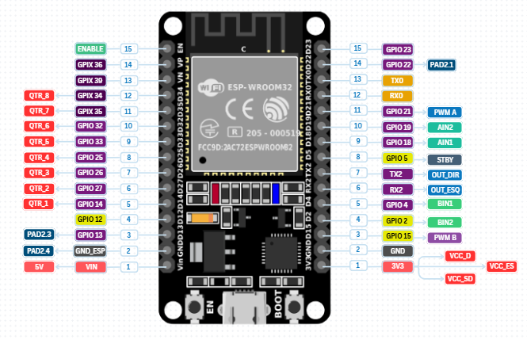

Pinout utilizado para identificar as conexões entre a ESP32 e os demais componentes do robô, incluindo sensores, ponte H e MOSFET de acionamento da ventoinha.

### Ponte H TB6612FNG

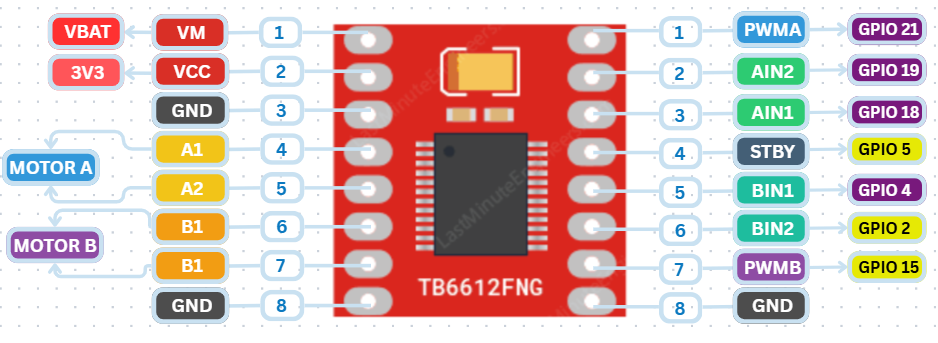

A ponte H TB6612FNG é utilizada para controlar os dois motores N20 responsáveis pela locomoção do robô. Ela recebe sinais PWM da ESP32 permitindo controlar a velocidade e o sentido de rotação dos motores.

### Sensor de Linha QTR-8RC

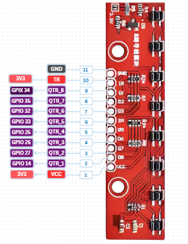

O sensor QTR-8RC é o sensor principal do robô, sendo responsável pela detecção da linha da pista. Ele é composto por um conjunto de sensores infravermelhos dispostos em forma de array que permitem identificar a posição da linha em relação ao robô.

### Sensor Infravermelho TCRT5000

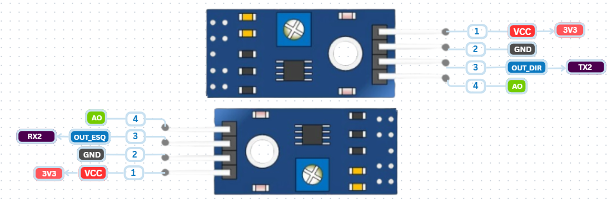

Os sensores TCRT5000 são utilizados como sensores auxiliares para detecção de linhas laterais e marcações ao longo da pista. Eles funcionam através da emissão e recepção de luz infravermelha refletida pela superfície.

### MOSFET IRLZ44N

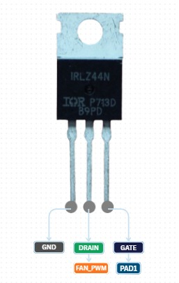

O MOSFET IRLZ44N é utilizado para controlar o acionamento do motor coreless responsável pela ventoinha de sucção do robô. Ele atua como uma chave eletrônica controlada pelo microcontrolador.

### Regulador de Tensão Mini360

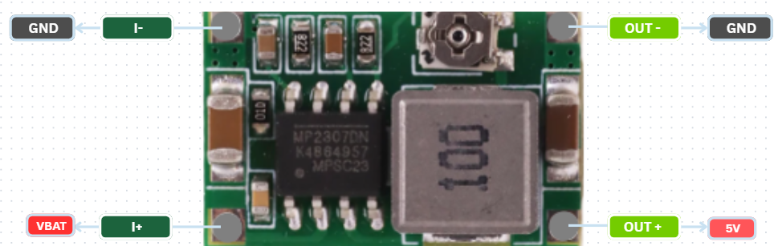

O módulo Mini360 é um conversor DC-DC do tipo buck responsável por reduzir a tensão da bateria LiPo para um nível adequado para alimentação da ESP32 e dos demais componentes eletrônicos do sistema.

### Bateria LiPo 2S 7.4V

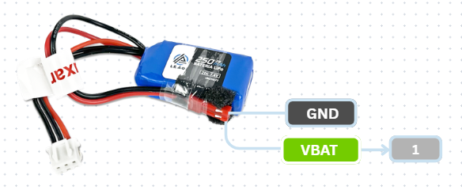

A bateria LiPo 2S de 7,4 V é a fonte principal de alimentação do sistema, fornecendo energia para os motores e para o circuito eletrônico do robô.

### Motor DC N20 3000 RPM

Os motores N20 são responsáveis pela locomoção do robô. Eles recebem alimentação através da ponte H TB6612FNG que controla a velocidade e o sentido de rotação.

### Motor Coreless 8523

O motor coreless 8523 é utilizado no sistema de sucção do robô. Esse tipo de motor é capaz de atingir altas rotações e é amplamente utilizado em aplicações que exigem baixo peso e alta eficiência.

### Diodo 1N4007

O diodo 1N4007 é utilizado como diodo de flyback para proteger o MOSFET contra picos de tensão gerados pelo motor coreless durante o desligamento.

### Resistores

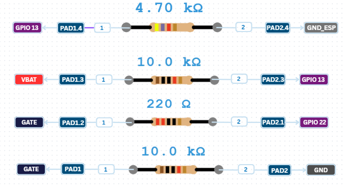

Os resistores são utilizados no circuito para limitar corrente e para implementação de divisores de tensão, como no caso do monitoramento da bateria.

### Switch

O switch é utilizado para ligar e desligar o sistema eletrônico do robô, controlando a alimentação proveniente da bateria.

### Capacitores (Eletrolítico e Cerâmico)

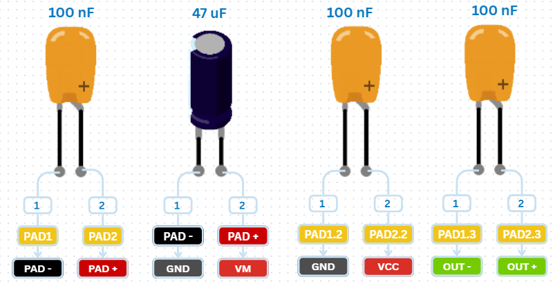

### Capacitores dos motores

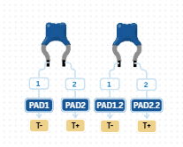

Os capacitores são soldados em paralelo com os terminais dos motores com o objetivo de eliminar os ruídos e melhorar seu funcionamento

Os capacitores são utilizados para desacoplamento e filtragem de ruído no circuito eletrônico, contribuindo para maior estabilidade da alimentação do sistema.

# PCB

A placa de circuito impresso (PCB) foi desenvolvida para integrar todos os componentes eletrônicos do robô em uma única estrutura organizada e confiável. O layout da placa foi projetado utilizando a ferramenta *EasyEDA*, permitindo a definição do posicionamento dos componentes e o roteamento das trilhas do circuito.

Durante o desenvolvimento foram aplicadas boas práticas de projeto eletrônico, como a separação entre trilhas de potência e trilhas de sinal, uso de capacitores de desacoplamento e organização eficiente dos componentes na placa.

Para permitir diferentes formas de prototipagem e fabricação, o projeto da PCB foi desenvolvido em duas versões: uma versão destinada à fabricação industrial e outra versão adaptada para usinagem em máquina CNC. Na versão industrial é utilizado um *plano de terra (GND plane)* distribuído pela placa, enquanto na versão usinada em CNC o aterramento é realizado através de *trilhas de GND conectando os componentes do circuito*.

### Especificações da PCB

| Parâmetro | Valor |
|-----------|------|
| Software de projeto | EasyEDA |
| Tipo de placa | PCB dupla camada |
| Dimensões da placa | 120 mm × 124 mm |
| Alimentação principal | Bateria LiPo 2S (7,4 V) |
| Plano de terra | GND plane |
| Fabricação industrial | JLCPCB |
| Versão alternativa | PCB usinada em CNC |

## Esquemático Eletrônico

O esquemático eletrônico do circuito foi desenvolvido no EasyEDA e representa todas as conexões elétricas entre os componentes do robô, incluindo a alimentação, controle dos motores, sensores e circuito de acionamento da turbina de sucção.

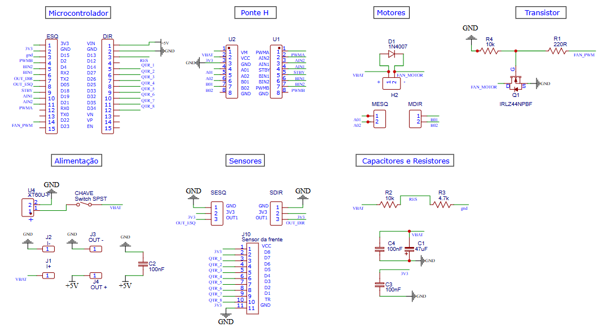

## Evolução da PCB

Durante o desenvolvimento do projeto foram realizadas diversas alterações no layout da placa, buscando melhorar o posicionamento dos componentes, otimizar o roteamento das trilhas e adaptar o circuito aos diferentes processos de fabricação.

Como o projeto possui duas versões de placa a evolução de cada versão é apresentada separadamente.

## PCB Industrial (JLCPCB)

### Primeira versão da PCB

A primeira versão do layout da placa, desenvolvida para fabricação industrial em dupla camada, foi criada em fevereiro. Essa etapa teve como principal objetivo servir como treinamento e aprendizado no desenvolvimento de PCBs mais profissionais, por isso o design adotou um formato mais retangular e simples. Inicialmente, a proposta era apenas produzir uma placa compacta funcional, permitindo estudar melhor a organização dos componentes e o roteamento das trilhas.

Mesmo sendo uma versão inicial, foi possível posicionar todos os componentes necessários, organizar os circuitos de forma mais eficiente e realizar o roteamento das trilhas de alimentação e sinal. Além disso, também foram feitos os primeiros cálculos de largura de trilha, considerando principalmente a distribuição de corrente no circuito.

Essa versão foi consideravelmente mais simples em comparação às posteriores, porém teve um papel importante no desenvolvimento do projeto. O objetivo principal era apresentar a evolução inicial da placa aos demais integrantes do grupo e ao líder da equipe, permitindo receber opiniões, sugestões e avaliar a viabilidade do desenvolvimento até aquele momento.

  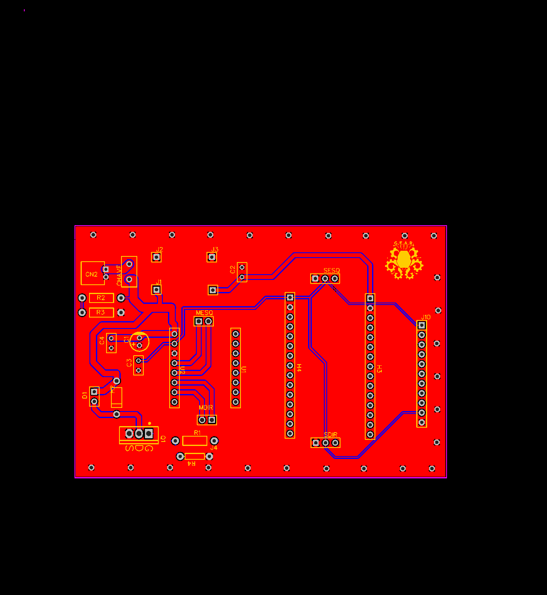
  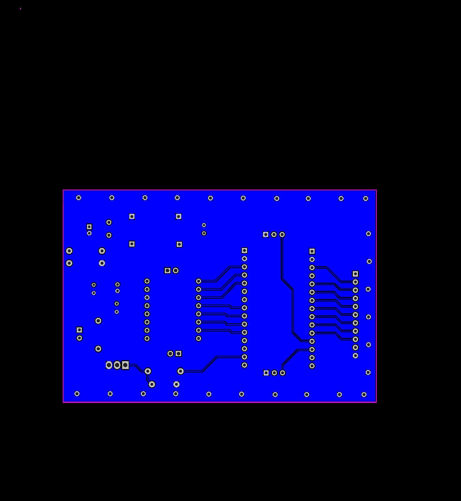

### Versão final da PCB

Para a segunda versão, surgiu a proposta do integrante responsável pela parte mecânica de transformar a própria placa em um chassi estrutural do robô. A ideia principal era reduzir o peso total do projeto, otimizar o espaço interno e tornar a montagem mais prática e eficiente. Dessa forma, a PCB deixaria de ser apenas uma placa eletrônica e passaria também a exercer função estrutural, permitindo fixar diretamente componentes mecânicos como sensores, suportes, ventoinhas e outros acessórios.

O modelo do chassi foi desenvolvido pelo mecânico em formato SVG e posteriormente importado para o EasyEDA, onde iniciou-se uma nova etapa de posicionamento dos componentes eletrônicos e roteamento das trilhas. Diferente da primeira versão, esse modelo trouxe desafios significativamente maiores, principalmente devido ao espaço reduzido disponível para acomodar os componentes e realizar o roteamento adequado das conexões elétricas.

Além da necessidade de encaixar corretamente todos os componentes no novo formato da placa, também foi preciso planejar cuidadosamente o trajeto das trilhas em áreas bastante limitadas, evitando interferências e mantendo a integridade elétrica do circuito. Após diversos ajustes, reorganizações e validações, foi possível concluir a versão final da PCB/chassi e verificar todas as conexões através das ferramentas de validação do próprio software, garantindo o funcionamento correto do projeto antes da fabricação.

  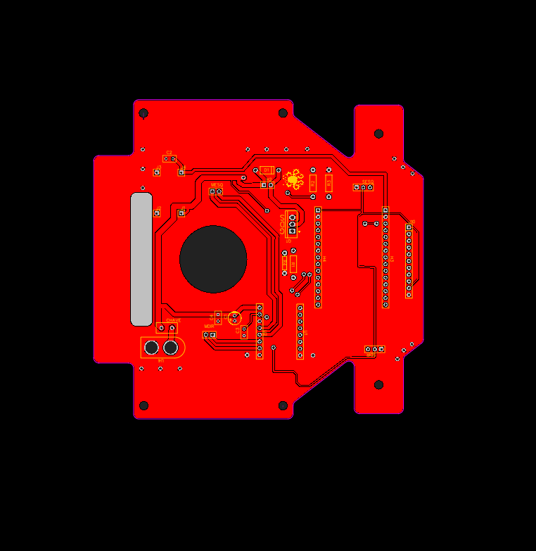
  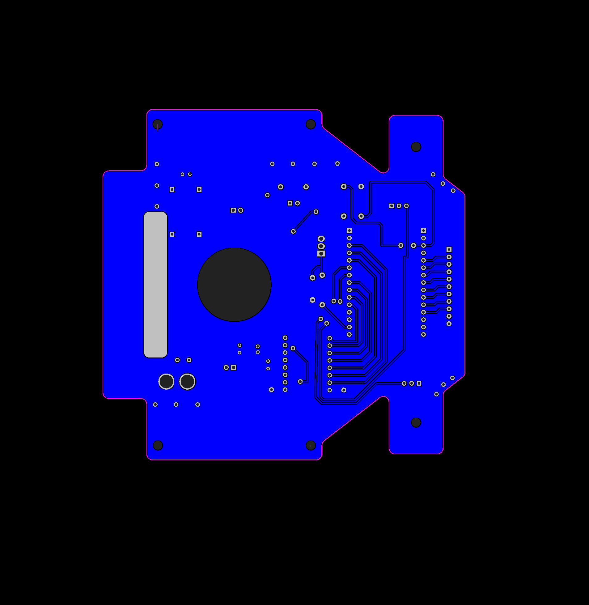

### Placa Física

Após um período de grande expectativa, a fabricação da PCB foi concluída e as placas finalmente chegaram em Manaus. O lote veio com cinco unidades, o que possibilitou maior segurança durante a etapa de montagem e testes. Assim que chegaram, iniciou-se imediatamente o processo de soldagem e fixação dos componentes eletrônicos na placa. Essa etapa foi, sem dúvidas, uma das mais desafiadoras de todo o desenvolvimento para mim pois alguns componentes possuíam terminais muito pequenos e exigiam maior precisão durante a soldagem, aumentando significativamente o nível de dificuldade da montagem. Além disso, qualquer excesso de estanho ou pequeno erro poderia comprometer trilhas e conexões importantes da placa.

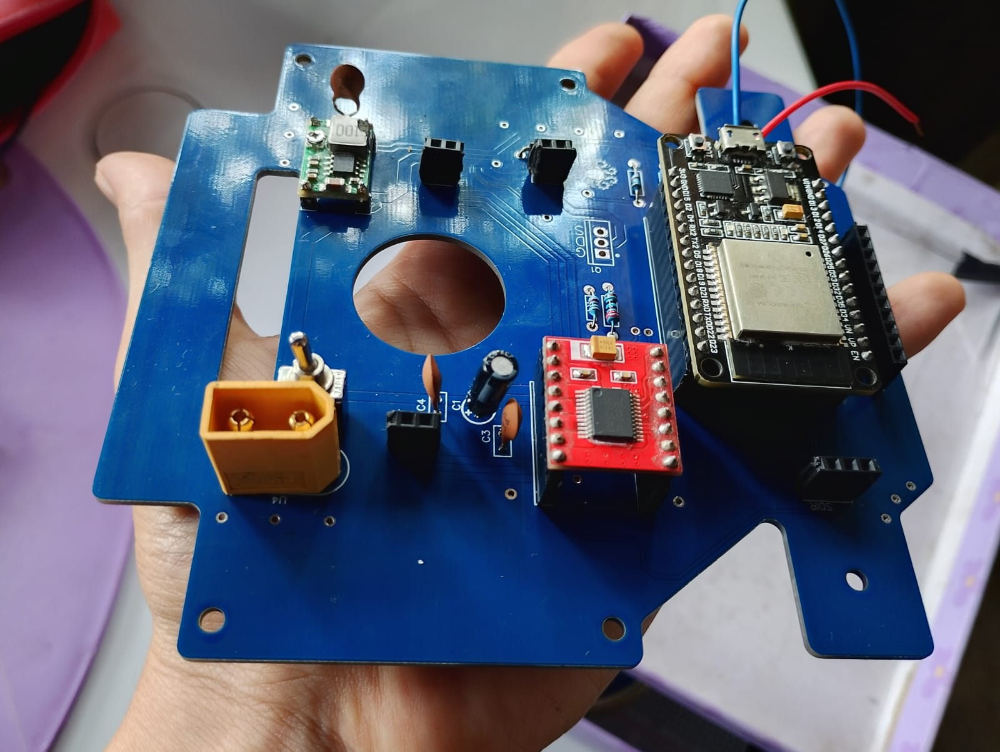

A primeira unidade montada apresentou alguns problemas relacionados à soldagem, principalmente em pontos mais críticos do circuito. Por conta disso, o líder da equipe decidiu utilizar uma segunda placa para continuar o desenvolvimento. Após soldar novamente e realizar diversos ajustes e bastante dedicação durante o processo de soldagem, todos os componentes foram corretamente instalados e, para nossa satisfação, a placa ligou já no primeiro teste funcional (com apenas a esp32 encaixada). Mesmo sendo necessários alguns ajustes posteriores e pequenas correções ao longo da validação do hardware, o resultado final foi extremamente positivo e marcou uma etapa importante no desenvolvimento do robô.

  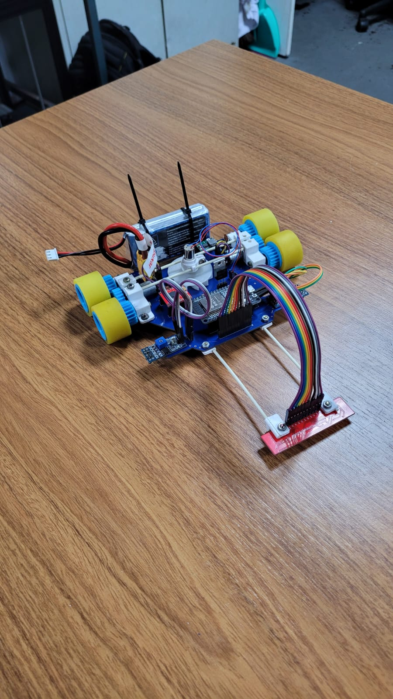
  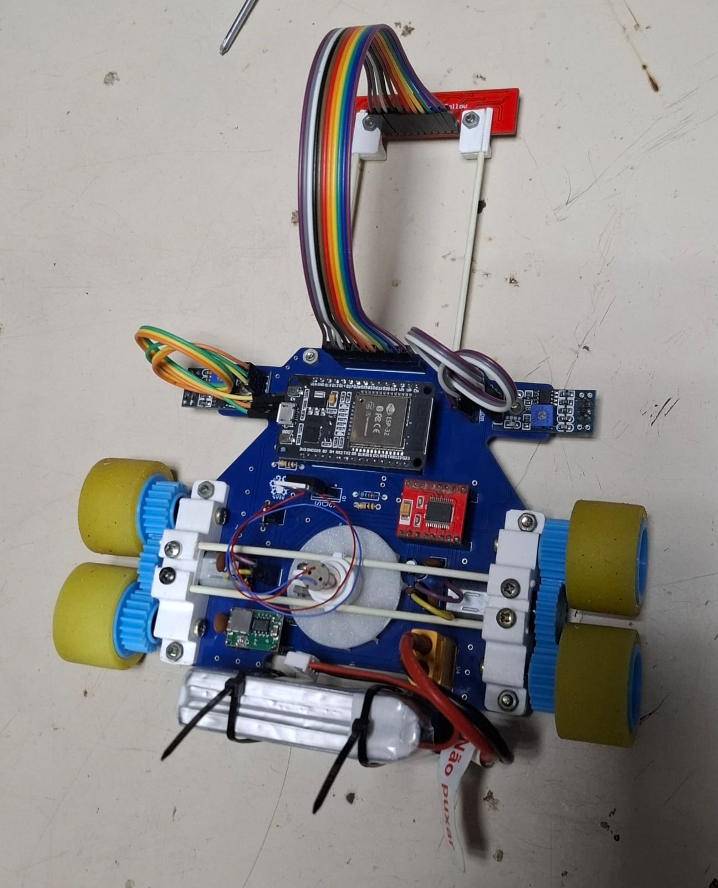

Com isso, após a realização de mais alguns testes para validar todo o circuito, foi possível confirmar o funcionamento correto da placa em conjunto com os demais sistemas do robô. Dessa forma, o desenvolvimento da PCB JLC foi finalmente concluído, tanto na parte eletrônica quanto na integração mecânica, resultando em uma versão totalmente funcional do projeto.

## PCB Fabricada em CNC

### Primeira versão da PCB CNC

A ideia de desenvolver uma versão usinada da placa em máquina CNC surgiu devido à possibilidade de não conseguirmos solicitar a fabricação da PCB na China, principalmente por conta do tempo de entrega e dos custos envolvidos, já que além do valor em dólar também existem taxas adicionais de importação.

Felizmente, conseguimos realizar o pedido da placa industrial, mas enquanto ela ainda estava em transporte para o Brasil, decidimos continuar o desenvolvimento da versão usinada como alternativa e também como forma de aprendizado. Para isso, foi utilizado o mesmo modelo de placa/chassi e o mesmo posicionamento dos componentes da versão original, alterando principalmente o roteamento das trilhas.

Nessa versão, as trilhas precisavam ser mais largas devido ao processo de usinagem, além da limitação de espaço causada pela grande quantidade de conexões em áreas pequenas, o que tornou o desenvolvimento um desafio considerável. Outro ponto importante foi a necessidade de exportar o projeto em formato bitmap, fazendo com que fosse necessário utilizar o software Proteus. Com isso, toda a parte esquemática, posicionamento dos componentes e roteamento precisou ser refeita praticamente do zero, processo que levou cerca de dois dias para ser concluído.

  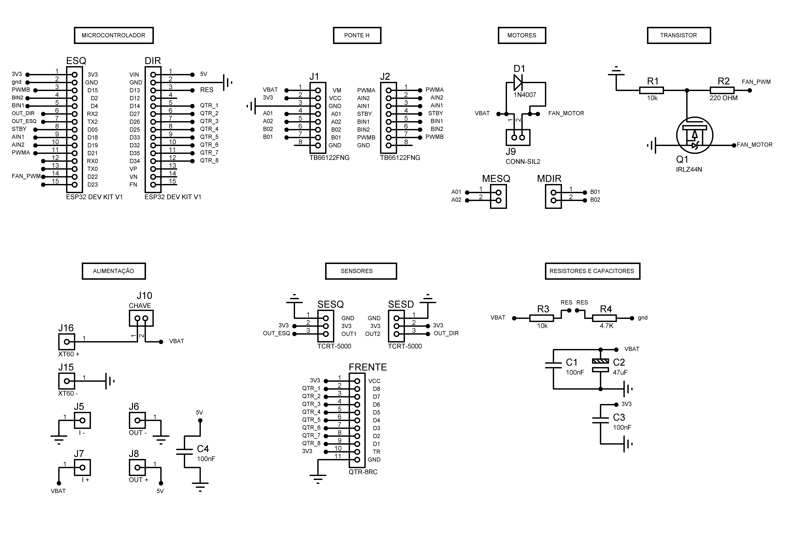
  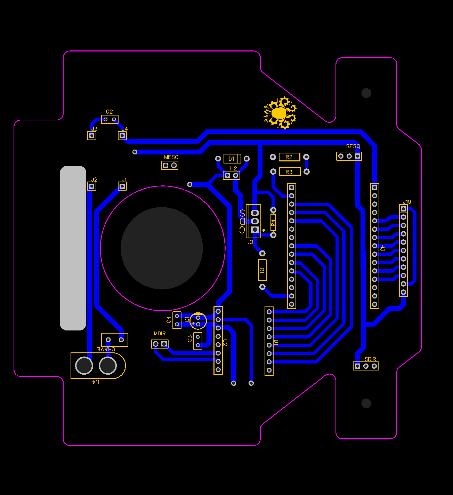

Após essa etapa, iniciamos o processo de usinagem da placa no FabLab, utilizando a máquina MonoFab. Toda a parte de vetorização necessária para a fabricação foi realizada pelo atual vice-capitão do gear, Raysson, permitindo que a PCB fosse finalmente usinada e preparada para os testes físicos do projeto.

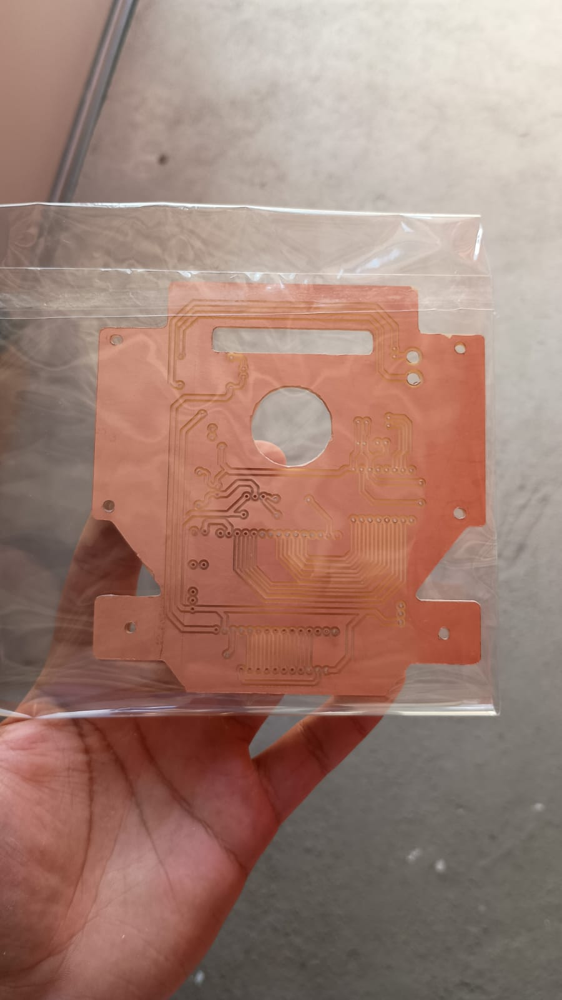

Com isso, iniciei os testes de soldagem na PCB usinada, porém essa acabou sendo a etapa mais complicada do processo. Diferente das placas industriais, a soldagem em placas de fenolite usinadas possui diversas limitações que, se não forem seguidas corretamente, podem comprometer toda a placa.Durante aproximadamente uma semana foram realizados vários testes de solda, mas os resultados avançavam lentamente. Qualquer pequeno contato entre o terminal do componente e áreas indevidas da placa podia gerar curto-circuito, além de que o excesso de retrabalho durante a soldagem acabava danificando os pads ou até rompendo algumas trilhas do circuito. Ao todo, foram produzidas duas versões da placa usinada, porém ambas acabaram sendo perdidas devido aos danos causados durante o processo de montagem e soldagem.

  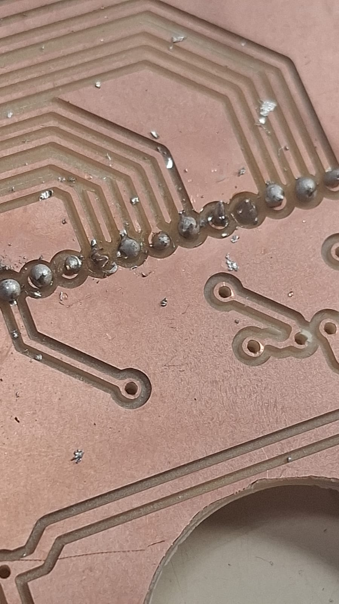
  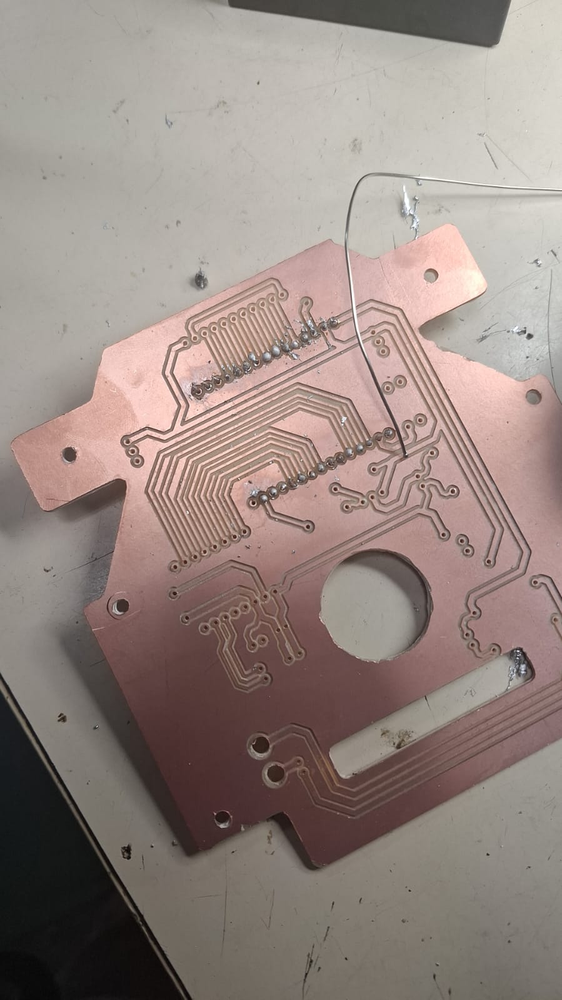

Por fim, com a chegada das placas fabricadas pela JLCPCB, nosso líder decidiu direcionar totalmente os esforços para a versão industrial da PCB, já que ela apresentava maior confiabilidade, melhor acabamento e menos limitações durante a montagem e soldagem. Dessa forma, o desenvolvimento da versão usinada acabou sendo interrompido e deixado em segundo plano. Mesmo não sendo concluída, essa etapa foi extremamente importante para adquirir experiência com processos de fabricação CNC, limitações de placas fenolite e técnicas de roteamento e soldagem em PCBs usinadas.

## Estrutura

- `design/`: Diretório contendo o design e diagramas da placa, em PDF ou formato de imagem. Exemplo:
  - Diagrama de conexão
  - Diagramas de pinout

- `img/`: Diretório contendo fotos das versões da placa real.

- `pcb/`: Diretório contendo os arquivos necessários para fazer a placa de circuito impresso, como Esquemático Eletrônico e arquivo Gerber.
