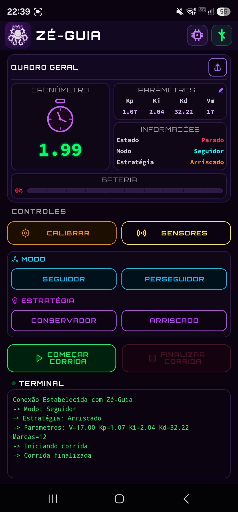
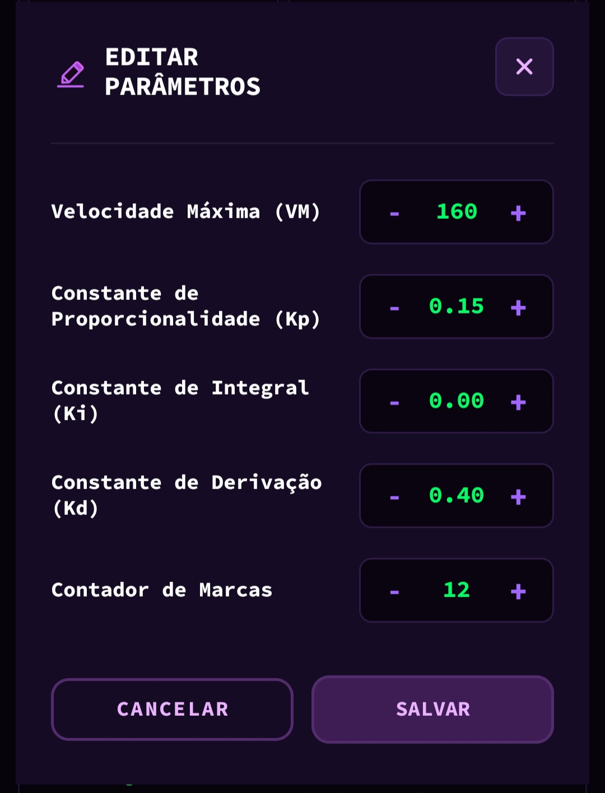
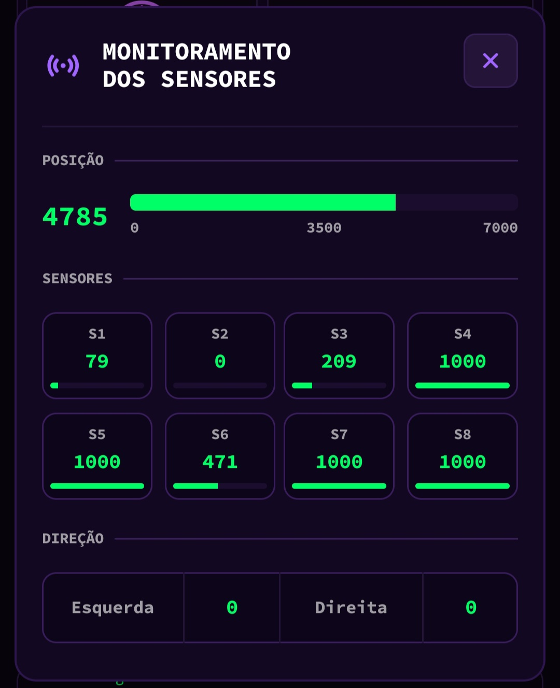
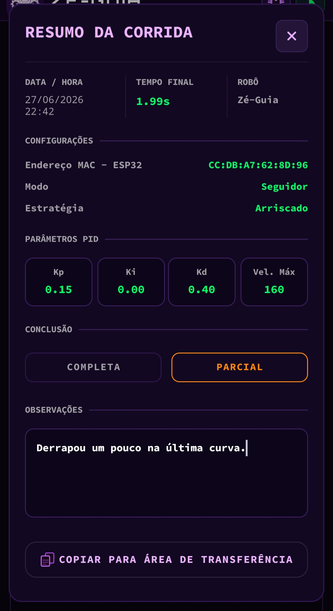
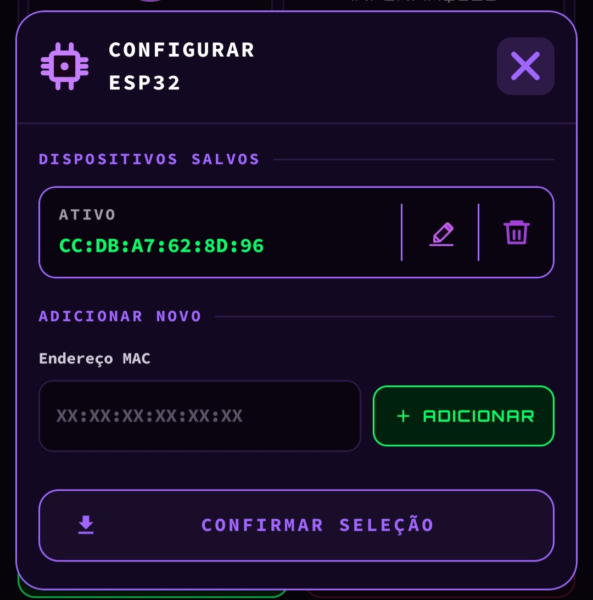
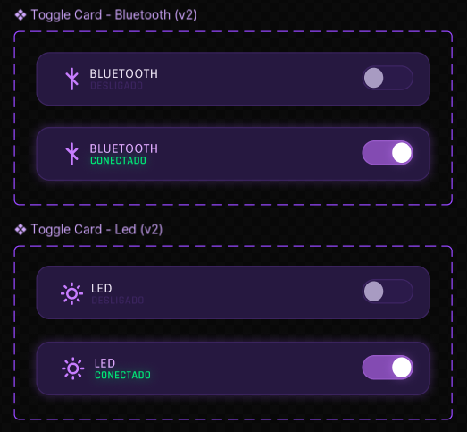
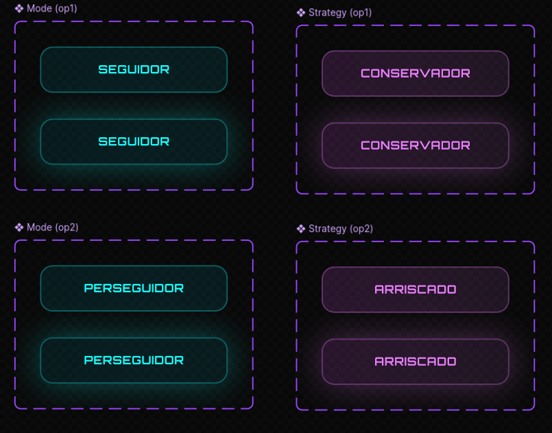
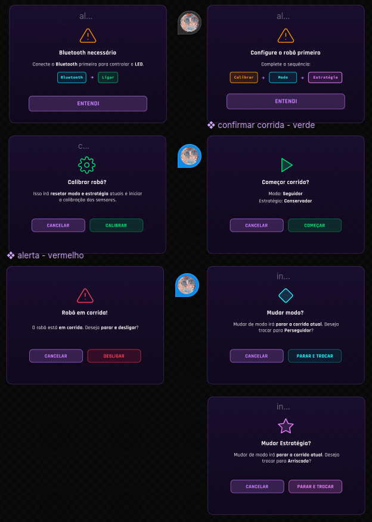
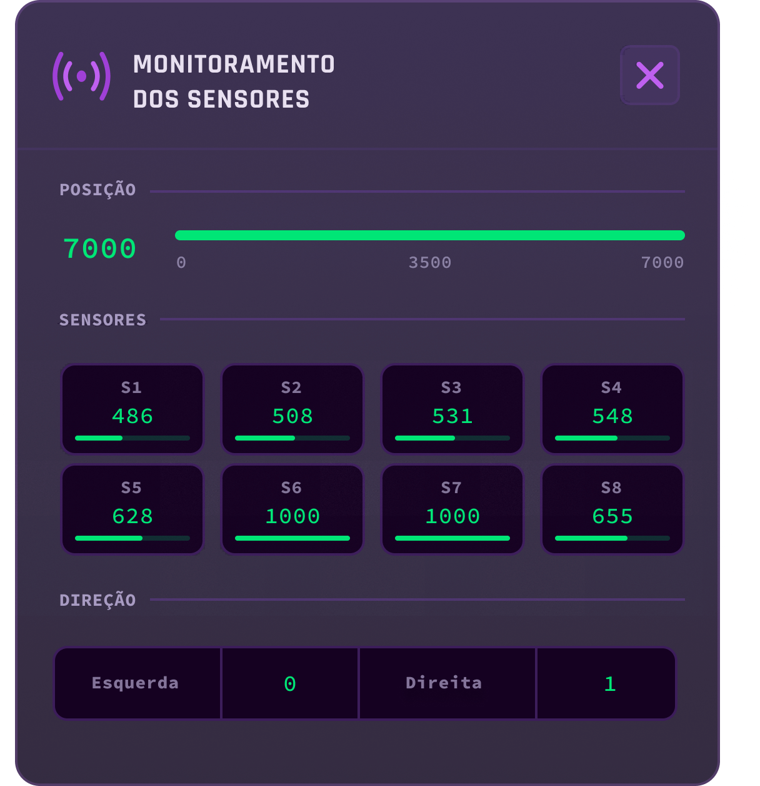
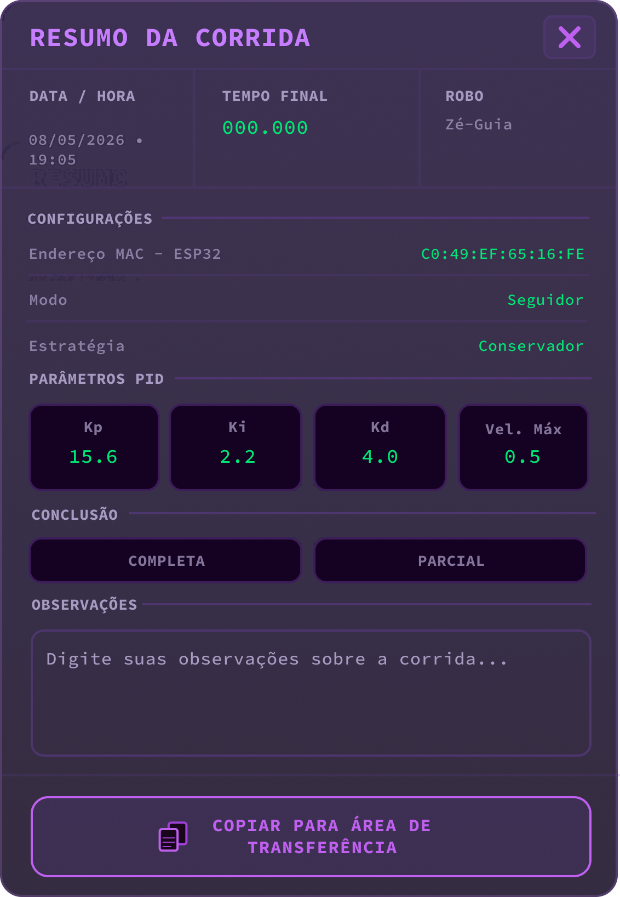

# Diretório de Interface

Este diretório contém todos os arquivos relacionados ao desenvolvimento da interface de controle do robô seguidor de linha do projeto *SEGUIDOR-2026*.

Aqui está reunida a aplicação Android **ZeGuiaApp**, desenvolvida em *Kotlin* no *Android Studio*, que permite ao operador monitorar e controlar o robô em tempo real por meio de conexão Bluetooth. O diretório reúne o código-fonte do aplicativo, a evolução do design no Figma e os registros de cada versão lançada ao longo do projeto.

O objetivo deste diretório é documentar a arquitetura do aplicativo, registrar a evolução das versões e facilitar a compreensão do funcionamento completo da interface de controle.

---

## Visão Geral

<video controls src="img/tela-principal/VisaoGeral.mp4" alt="Vídeo de demonstração do ZeGuiaApp em funcionamento durante uma corrida completa">Seu navegador não suporta vídeo HTML5.</video>

*Demonstração do ZeGuiaApp em funcionamento completo*

O **ZeGuiaApp** é um aplicativo Android nativo desenvolvido em **Kotlin** com arquitetura modular baseada em helpers especializados e Activity única (`MainActivity`). A lógica é distribuída em 11 arquivos Kotlin, cada um com responsabilidade única: a `MainActivity` atua como orquestradora, conectando os helpers entre si e implementando a interface `BluetoothEventListener` para reagir aos eventos da ESP32. Os layouts são definidos em arquivos XML separados por tela e modal.

A comunicação com o robô é feita via **Bluetooth Classic** (protocolo RFCOMM, SPP), trocando mensagens de texto simples entre o aplicativo e o firmware da ESP32.

### Tecnologias Utilizadas

| Tecnologia | Versão | Descrição |
|---|---|---|
| Kotlin | 1.9+ | Linguagem principal do aplicativo |
| Android SDK | API 24+ | Plataforma alvo |
| AndroidX | - | Componentes de UI modernos |
| Material Design 3 | - | Sistema de design visual |
| Bluetooth Classic (RFCOMM) | - | Comunicação com a ESP32 |
| SharedPreferences | - | Persistência local de parâmetros |
| Coroutines (lifecycleScope) | - | Operações assíncronas |

---

## Ícone do Aplicativo


*Ícone oficial do ZeGuiaApp*

---

## Tela Principal

A tela principal do aplicativo é composta por seções organizadas verticalmente, cada uma com uma função específica no controle do robô.



*Tela principal do ZeGuiaApp — versão final (v10)*

### Estrutura da Tela

#### Header

Barra superior com fundo escuro `#130822` contendo logo, título e dois botões de ação:

- **Logo do GEAR** — ícone clicável com fundo gradiente roxo que abre o modal "Sobre Nós"
- **Título ZÉ-GUIA** — fonte Orbitron em branco com espaçamento entre letras
- **Botão ESP32** — ícone de chip roxo; ao tocar, abre o modal de configuração de endereços MAC
- **Botão Bluetooth** — ícone de Bluetooth; muda de cor conforme o estado: roxo `#A066FF` quando desconectado, laranja durante a tentativa de conexão e verde `#00FF66` quando conectado; toque liga e desliga a conexão

#### Card Quadro Geral

Card principal com label **QUADRO GERAL** e botão de exportar no canto superior direito (ícone de upload, habilitado somente após uma corrida finalizada). Internamente dividido em dois blocos lado a lado:

- **Bloco esquerdo — Cronômetro**: ícone gráfico de relógio e display digital verde neon no formato `SS.cc` (segundos inteiros e centésimos)
- **Bloco direito — Parâmetros**: exibe Kp, Ki, Kd e Vm do modo/estratégia atual com ícone de lápis para abrir edição; abaixo, seção **INFORMAÇÕES** com Estado, Modo e Estratégia do robô em tempo real

#### Card Bateria

Card separado abaixo do Quadro Geral. Exibe o percentual numérico à esquerda e uma barra de progresso contínua à direita. A cor muda dinamicamente: ciano `#00E5FF` acima de 50%, laranja abaixo de 50% e vermelho abaixo de 20%.

#### Seção Controles

Dois botões lado a lado:

- **CALIBRAR** — envia o comando `K` para o firmware; o robô percorre os sensores sobre a pista e o fundo branco para aprender os valores mínimos e máximos de reflexão de cada sensor, definindo os limiares que diferenciam linha de fundo. Sem calibração, o robô não consegue interpretar corretamente a posição da linha. Todos os demais botões ficam bloqueados durante a calibração.
- **SENSORES** — abre o modal de leitura dos sensores em tempo real. Útil para verificar se os sensores estão lendo corretamente antes de uma corrida — por exemplo, identificar sensores sujos, mal posicionados ou com valores fora do esperado — sem precisar iniciar a corrida.

#### Seção Modo

Agrupamento com dois botões de seleção:

- **SEGUIDOR** — o robô segue a linha da pista e para de forma autônoma; envia comando `S`
- **PERSEGUIDOR** — além de seguir a linha, o robô deve chegar perto de alcançar o robô adversário na pista; envia comando `P`

#### Seção Estratégia

Aparece abaixo da seleção de modo:

- **CONSERVADOR** — parâmetros calibrados para garantir que o robô complete a volta com segurança, priorizando estabilidade sobre velocidade; envia comando `C`
- **ARRISCADO** — parâmetros com maior velocidade e ganhos mais agressivos, mas com maior risco de o robô perder a linha; envia comando `A`

#### Botões de Corrida

Dois botões de destaque visual:

- **COMEÇAR CORRIDA** — envia comando `R`; disponível somente após modo e estratégia selecionados
- **FINALIZAR CORRIDA** — envia comando `F`; disponível somente durante a corrida

#### Terminal

Monitor de texto com fundo escuro que exibe todas as mensagens recebidas do robô via Bluetooth, com scroll automático para a última linha. Mensagens de bateria (`BAT`), sensores (`S,`) e parâmetros (`PARAMS:`) são tratadas internamente sem aparecer no terminal.

---

## Modais

### Modal: Editar Parâmetros

Acessado pelo ícone de lápis no card de parâmetros. Só pode ser aberto após a seleção de modo e estratégia.

Permite editar os cinco parâmetros da configuração atual:

| Campo | Tipo | Incremento |
|---|---|---|
| VM (Velocidade Máxima) | Inteiro | ±1 |
| Kp | Float | ±0,01 |
| Ki | Float | ±0,01 |
| Kd | Float | ±0,01 |
| Marcas | Inteiro | ±1 |

Cada parâmetro possui botões `+` e `−` (stepper) e campo de edição direta. Ao salvar, os valores são armazenados no `SharedPreferences` com prefixo `modo_estrategia_` e enviados ao firmware no formato:

```
PID:VM|Kp|Ki|Kd|Marcas
```




*Modal de edição de parâmetros — steppers de ±0,01 para Kp, Ki, Kd e ±1 para VM e Marcas*


---

### Modal: Sensores

Acessado pelo botão SENSORES. Exibe a leitura em tempo real dos 8 sensores do array QTR-8RC e dos 2 sensores laterais (esquerdo e direito) em uma grade 4×2.

Ao abrir, envia o comando `L` ao firmware para iniciar o stream de dados de sensores. Ao fechar, envia o comando `l` para encerrar o stream.

O formato de exibição é:

```
POS: XXXX
 S1  |  S2  |  S3  |  S4
 S5  |  S6  |  S7  |  S8
ESQ: XX | DIR: XX
```



*Modal de sensores — leitura em tempo real dos 8 sensores ópticos e sensores laterais*

---

### Modal: Exportar

Acessado pelo botão EXPORTAR, disponível somente após o término de uma corrida (estado `Parado`).

Gera um resumo formatado da corrida com os dados:

- Data e hora
- Tempo final em segundos
- Modo e estratégia utilizados
- Quantidade de marcas
- Parâmetros PID (VM, Kp, Ki, Kd)
- Status da corrida (Completa / Parcialmente / Interrompida)
- Campo de observações livres

O botão de copiar só é habilitado após a seleção do status da corrida. O resumo é copiado para a área de transferência do celular para facilitar o registro de performance.



*Modal de exportar — resumo da corrida pronto para copiar para a área de transferência*

---

### Modal: Configurar ESP32

Acessado pelo badge de MAC no header. Só pode ser aberto quando o robô está desconectado ou com estado `Parado`.

Permite:

- **Selecionar** uma ESP32 já cadastrada via Spinner (lista dropdown)
- **Cadastrar** um novo endereço MAC digitando no campo de texto (formatação automática com `:`)
- **Editar e excluir** endereços MACs salvos

O campo de texto formata automaticamente o MAC conforme a digitação, inserindo os dois pontos nos lugares corretos. O MAC é validado contra o padrão `XX:XX:XX:XX:XX:XX` antes de ser salvo.

Os endereços MAC são persistidos em `SharedPreferences` como um conjunto (`Set<String>`), permitindo alternar entre diferentes unidades do robô sem redigitar.



*Modal de configuração da ESP32 — gerenciamento de endereços MAC salvos*


---

### Modal: Sobre Nós

Acessado pelo logo do GEAR no header.

Exibe informações sobre a equipe criadora do robô, incluindo nomes, funções, logo do GEAR, logo da instituição e QR Code para o Instagram do GEAR.

<video controls src="img/modais/Modal_SobreNos.mp4" alt="Vídeo do modal Sobre Nós com animação de luzes sequenciais inspirada no grid de largada da Fórmula 1, exibindo nomes e funções da equipe GEAR">Seu navegador não suporta vídeo HTML5.</video>

*Modal Sobre Nós — animação de largada F1 com apresentação da equipe, logo GEAR e QR Code do Instagram*

---

## Arquivos Kotlin

O código segue uma arquitetura modular com 11 arquivos Kotlin, cada um com responsabilidade única. A `MainActivity` atua como orquestradora, instanciando e conectando os helpers via injeção manual de dependências e implementando os callbacks de `BluetoothEventListener`.

### `BluetoothEventListener.kt`

Interface Kotlin que define os callbacks de eventos de conexão e dados recebidos da ESP32. Implementada pela `MainActivity`, desacopla completamente o `BluetoothHelper` da Activity.

| Método | Disparado quando |
|---|---|
| `onConnected()` | Conexão RFCOMM estabelecida com sucesso |
| `onDisconnected()` | Conexão encerrada (deliberada ou inesperada) |
| `onConnectionFailed()` | Tentativa de conexão falhou |
| `onRawMessage(msg)` | Mensagem serial genérica recebida |
| `onEstado(valor)` | Recebeu `Estado: X` |
| `onModo(valor)` | Recebeu `Modo: X` |
| `onEstrategia(valor)` | Recebeu `Estrategia: X` |
| `onBateria(percentual)` | Recebeu `BATxx` |
| `onSensores(parts)` | Recebeu linha `S,...` |
| `onParams(parts)` | Recebeu `PARAMS:...` |

---

### `BluetoothHelper.kt`

Gerencia a conexão RFCOMM com a ESP32 em threads separadas. Parseia as mensagens recebidas e dispara os callbacks da `BluetoothEventListener`. Detecta desconexões inesperadas (ex: ESP32 desligada durante corrida) e notifica via `onDisconnected()`.

---

### `BluetoothIconHelper.kt`

Atualiza o ícone e o card de Bluetooth conforme o estado da conexão. Aplica `ColorFilter` ao ícone e modifica o `GradientDrawable` do card (borda + fundo semi-transparente) para três estados:

| Estado | Cor do ícone e borda |
|---|---|
| Desconectado | Roxo `#A066FF` |
| Conectando | Laranja `#FF8800` |
| Conectado | Verde `#00FF66` |

---

### `CronometroHelper.kt`

Controla o cronômetro de corrida. Exibe o tempo no formato `SS.cc` (segundos e centésimos). Atualiza o `TextView` a cada 50 ms via `Handler`. Expõe os métodos `iniciar()`, `parar()` e `resetar()`.

---

### `UiStateHelper.kt`

Máquina de estados de UI. Cada método `estadoXxx()` habilita ou desabilita os 9 botões de controle conforme o estado atual do robô, garantindo que o operador só interaja com ações válidas no momento.

---

### `ParametrosHelper.kt`

Gerencia os parâmetros PID (Kp, Ki, Kd, Vm, Marcas). Armazena o modo e estratégia ativos, calcula o prefixo de chave `modo_estrategia_` para o `SharedPreferences` e mantém o display atualizado. Exibe e controla o modal de edição com steppers de incremento/decremento.

---

### `SensoresHelper.kt`

Gerencia o modal de leitura em tempo real dos sensores. Exibe os 8 sensores ópticos em grade 4×2, a posição ponderada e as velocidades dos motores. Ativa o stream com `L` ao abrir e desativa com `l` ao fechar. As referências de view são nulas quando o modal está fechado, evitando memory leaks.

---

### `EspConfigHelper.kt`

Gerencia o modal de configuração da ESP32. Exibe a lista de MACs cadastrados e permite adicionar, editar e excluir entradas. Formata automaticamente o MAC com dois-pontos durante a digitação. Bloqueia a abertura durante corrida ativa (`Estado: Correndo`).

---

### `ExportarHelper.kt`

Gerencia o modal de exportação de feedback de corrida. Monta o resumo com data/hora, tempo em segundos, modo, estratégia e parâmetros PID. O botão de copiar só é habilitado após a seleção do status da corrida (Completa / Parcialmente / Interrompida). Copia o relatório final para a área de transferência.

---

### `SobreNosHelper.kt`

Singleton que gerencia o modal "Sobre Nós" e as animações associadas. O modal possui uma animação de luzes inspirada no grid de largada da Fórmula 1: as luzes acendem sequencialmente e apagam de uma vez simulando a largada. O ponto verde no terminal principal pisca a cada 900 ms enquanto a Activity está ativa.

---

### `MainActivity.kt`

Orquestradora da aplicação. Instancia e conecta todos os helpers via injeção manual de dependências, implementa a `BluetoothEventListener` e mantém o estado de sessão (MAC ativo, MACs salvos, flag `modoSelecionado`).

| Método | Responsabilidade |
|---|---|
| `onCreate()` | Inicializa views, helpers, listeners, permissões e restaura sessão anterior |
| `onDestroy()` | Destrói helpers com handlers e fecha o socket |
| `inicializarViews()` | Localiza e atribui todas as views do layout |
| `inicializarHelpers()` | Instancia todos os helpers e registra listeners de botões |
| `configurarListeners()` | Registra listeners do switch Bluetooth e dos cards do header |
| `animarClique()` | Animação de "apertar" (scale 78%→100%) nos botões do header |
| `atualizarEstadoEdicaoParametros()` | Habilita/desabilita o botão de edição conforme estratégia ativa |
| `atualizarBateria()` | Atualiza percentual e 10 barras de cor dinâmica |
| `onConnected()` / `onDisconnected()` / `onConnectionFailed()` | Callbacks Bluetooth → atualiza ícone e estado da UI |
| `onEstado()` / `onModo()` / `onEstrategia()` | Callbacks de estado do robô → aciona máquina de estados |
| `onBateria()` / `onSensores()` / `onParams()` | Callbacks de dados → delega ao helper responsável |

---

## Protocolo de Comunicação Bluetooth

### Comandos enviados pelo App → ESP32

| Comando | Ação |
|---|---|
| `K` | Iniciar calibração |
| `S` | Selecionar modo Seguidor |
| `P` | Selecionar modo Perseguidor |
| `C` | Selecionar estratégia Conservador |
| `A` | Selecionar estratégia Arriscado |
| `R` | Começar corrida |
| `F` | Finalizar corrida |
| `L` | Ligar stream de leitura de sensores |
| `l` | Desligar stream de leitura de sensores |
| `Q` | Solicitar parâmetros salvos no firmware |
| `PID:VM\|Kp\|Ki\|Kd\|Marcas` | Enviar parâmetros ao firmware |

### Mensagens recebidas pela ESP32 → App

| Prefixo | Conteúdo | Ação no App |
|---|---|---|
| `Estado: X` | `Correndo`, `Parado`, `Calibrando`, `Calibrado` | Atualiza label, cor e estado da máquina de estados |
| `Modo: X` | `Seguidor`, `Perseguidor` | Atualiza label e habilita botões de estratégia |
| `Estrategia: X` | `Conservador`, `Arriscado` | Atualiza label e habilita botão de iniciar corrida |
| `BATXX` | Número inteiro 0–100 | Atualiza barras e percentual de bateria |
| `PARAMS:modo\|estrat\|V\|Kp\|Ki\|Kd\|Marcas` | 7 campos separados por `\|` | Sincroniza parâmetros do firmware com o SharedPreferences |
| `S,pos,s1..s8,dir,esq` | 12 campos separados por `,` | Atualiza o modal de sensores |

---

## Máquina de Estados

O aplicativo implementa uma máquina de estados baseada nas mensagens recebidas do robô. Cada estado habilita ou desabilita um conjunto específico de botões da interface.

.drawio.png)

*Máquina de estados do aplicativo — transições disparadas por mensagens recebidas da ESP32*

| Estado | Gatilho | Botões habilitados |
|---|---|---|
| **Desconectado** | App iniciado / Switch BT desligado | Nenhum |
| **Conectado** | Conexão Bluetooth estabelecida | Calibrar, Seguidor, Perseguidor, Sensores |
| **Calibrando** | Recebeu `Estado: Calibrando` | Nenhum (todos bloqueados) |
| **Calibrado** | Recebeu `Estado: Calibrado` | Calibrar, Seguidor, Perseguidor, Sensores |
| **Pós-Modo** | Recebeu `Modo: X` | Seguidor, Perseguidor, Conservador, Arriscado, Sensores |
| **Pós-Estratégia** | Recebeu `Estrategia: X` | Conservador, Arriscado, Começar Corrida, Sensores |
| **Correndo** | Recebeu `Estado: Correndo` | Finalizar Corrida |
| **Finalizado** | Recebeu `Estado: Parado` | Todos (incluindo Exportar) |

---

## Fluxo de Uso do Aplicativo


O fluxo completo para realizar uma corrida é:

1. Abrir o aplicativo → estado Desconectado, ícone Bluetooth roxo
2. (Opcional) Tocar no botão de chip ESP32 no header → configurar ou selecionar endereço MAC
3. Tocar no botão Bluetooth → ícone fica laranja (conectando); ao conectar, fica verde e o app envia `Q` para sincronizar parâmetros
4. Selecionar **Modo** (Seguidor ou Perseguidor)
5. Selecionar **Estratégia** (Conservador ou Arriscado) → app envia os parâmetros salvos ao firmware e libera o botão de edição
6. (Opcional) Tocar no ícone de lápis para editar parâmetros
7. Pressionar **CALIBRAR** → aguardar estado Calibrado (ícone lápis bloqueado durante calibração)
8. Pressionar **COMEÇAR CORRIDA** → cronômetro inicia ao receber `Estado: Correndo`
9. Robô finaliza autonomamente ou operador pressiona **FINALIZAR CORRIDA** → cronômetro para
10. Pressionar **EXPORTAR** → selecionar status → adicionar observações → copiar resumo

---

## Como Executar o Aplicativo

### Pré-requisitos

- Android Studio Hedgehog (2023.1.1) ou superior
- JDK 17
- Android físico com API 24 (Android 7.0) ou superior
- Bluetooth Classic habilitado no celular

### Passos

```bash
# 1. Clone o repositório
git clone <url-do-repositorio>

# 2. Abra o Android Studio
# File > Open > selecione a pasta interface/ZeGuiaApp

# 3. Aguarde o Gradle sincronizar as dependências

# 4. Conecte um dispositivo Android via USB com depuração USB ativada

# 5. Execute pelo botão Run (▶) ou via terminal:
./gradlew assembleDebug
adb install app/build/outputs/apk/debug/app-debug.apk
```

### Permissões Necessárias

O `AndroidManifest.xml` declara as permissões de Bluetooth. Em dispositivos Android 12+ (API 31+), o aplicativo solicita em tempo de execução:

- `BLUETOOTH_CONNECT`
- `BLUETOOTH_SCAN`

### Pareamento da ESP32

Antes de usar o aplicativo, é necessário parear a ESP32 com o celular pelo menu de configurações de Bluetooth do Android. O aplicativo não realiza o pareamento, apenas a conexão com dispositivos já pareados.

---

## Evolução do Design — Figma

O design do ZeGuiaApp foi desenvolvido iterativamente no **Figma**. Abaixo estão os registros de cada versão do protótipo.

### Versão 1


*Tela principal — protótipo inicial*


*Cards de Bluetooth e LED — versão 1*


*Botões de controle de corrida — versão 1*

---

### Versão 2


*Tela principal — versão 2*



*Toggle card de Bluetooth e LED — versão 2*



*Seção de modos e estratégias — versão 2*



*Modais de alerta — versão 2*

---

### Versão 3


*Tela principal — versão 3*

.png)

*Toggle card de LED e Bluetooth — versão 3*

---

### Versão 4 — Final do Figma


*Tela principal — versão 4 (final do Figma)*


*Modal Sobre Nós — versão 4*


*Animação de luzes acesas no modal Sobre Nós — inspiração no grid de largada da F1*


*Toggle card de Bluetooth com estados visuais — versão 4*



*Modal de sensores — versão 4*


*Modal de edição de parâmetros — versão 4*


*Modal de configuração da ESP32 — versão 4*


*Seleção de ESP32 ativa — versão 4*



*Modal de feedback de corrida — versão 4*


*Seleção do status de conclusão da corrida — versão 4*


*Indicador de bateria com barras de cor dinâmica — versão 4*


*Botões de Calibrar e Sensores — versão 4*
---

## Estrutura de Diretórios

```
interface/
├── img/
│   ├── icone/                     # Ícone do aplicativo
│   ├── tela-principal/            # Screenshots da tela principal e vídeo geral
│   ├── modais/                    # Screenshots e vídeos de todos os modais
│   ├── fluxo/                     # Diagramas de máquina de estados e fluxo
│   └── figma/                     # Protótipos do Figma por versão
│       ├── v1/
│       ├── v2/
│       ├── v3/
│       └── v4/
└── ZeGuiaApp/
    └── app/
        └── src/
            └── main/
                ├── java/com/example/zeguiaapp/
                │   ├── MainActivity.kt            # Orquestradora; implementa BluetoothEventListener
                │   ├── BluetoothEventListener.kt  # Interface de callbacks de eventos
                │   ├── BluetoothHelper.kt         # Conexão RFCOMM, I/O serial, parse de mensagens
                │   ├── BluetoothIconHelper.kt     # Colorização do ícone e card Bluetooth
                │   ├── CronometroHelper.kt        # Cronômetro no formato SS.cc
                │   ├── UiStateHelper.kt           # Máquina de estados de botões
                │   ├── ParametrosHelper.kt        # PID, display e modal de edição
                │   ├── SensoresHelper.kt          # Modal de leitura de sensores em tempo real
                │   ├── EspConfigHelper.kt         # Modal de configuração de endereços MAC
                │   ├── ExportarHelper.kt          # Modal de exportação de feedback de corrida
                │   └── SobreNosHelper.kt          # Modal "Sobre Nós" e animação F1
                ├── res/
                │   ├── layout/
                │   │   ├── activity_main.xml      # Tela principal
                │   │   ├── editar_parametros.xml  # Modal de edição de parâmetros
                │   │   ├── modal_sensores.xml     # Modal de leitura de sensores
                │   │   ├── modal_exportar.xml     # Modal de exportar feedback
                │   │   └── modal_esp32.xml        # Modal de configuração da ESP32
                │   ├── drawable/                  # Ícones e backgrounds XML vetoriais
                │   ├── font/                      # Fontes Orbitron e Source Code Pro
                │   ├── mipmap-*/                  # Ícone do app em múltiplas densidades
                │   └── values/
                │       ├── colors.xml             # Paleta de cores do projeto
                │       ├── strings.xml            # Strings do aplicativo
                │       └── themes.xml             # Tema visual
                └── AndroidManifest.xml            # Permissões e configuração do app
```
