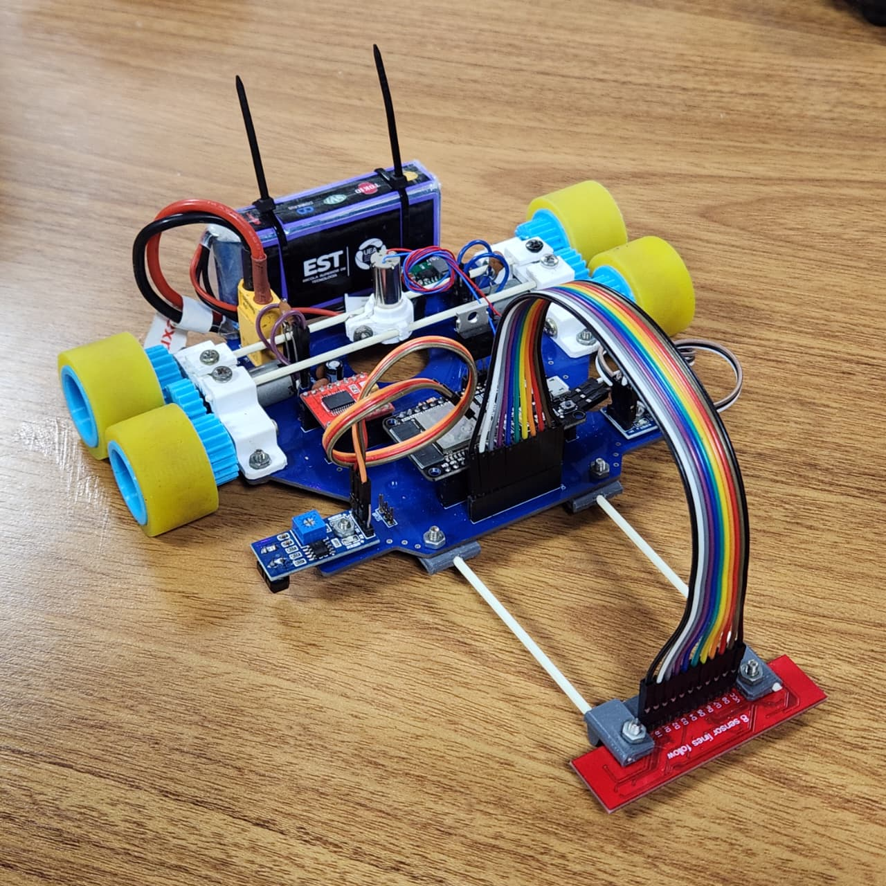
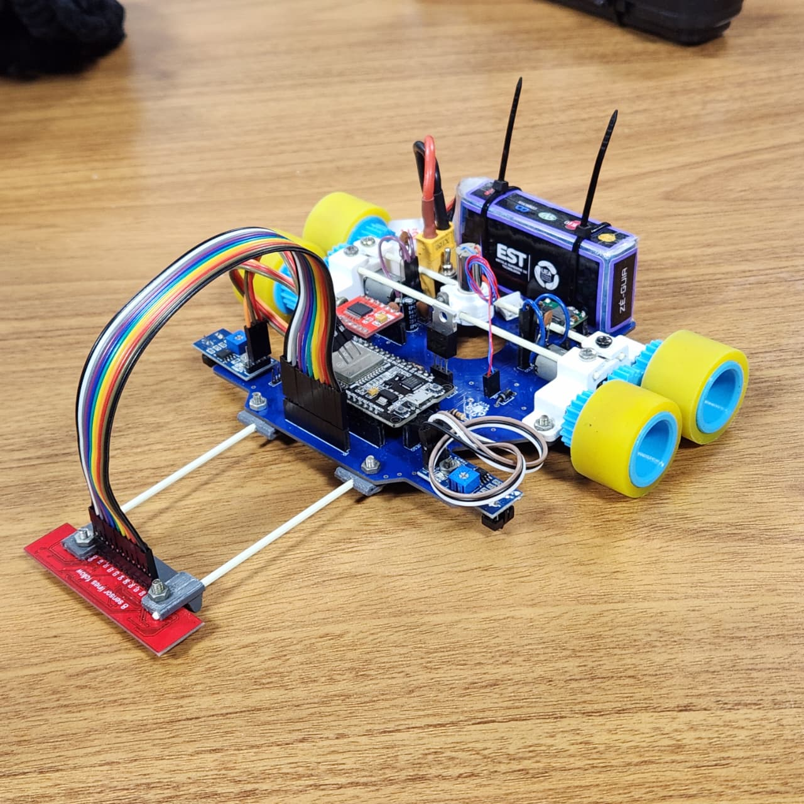
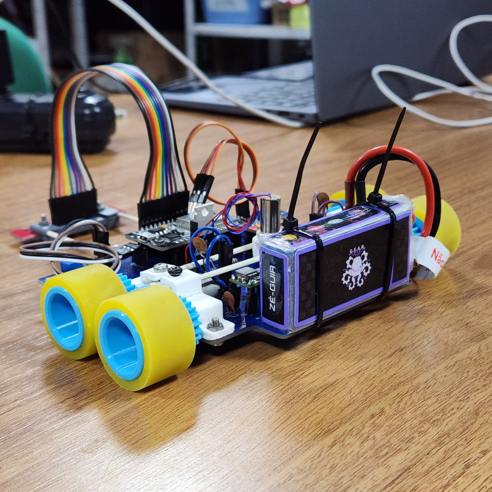
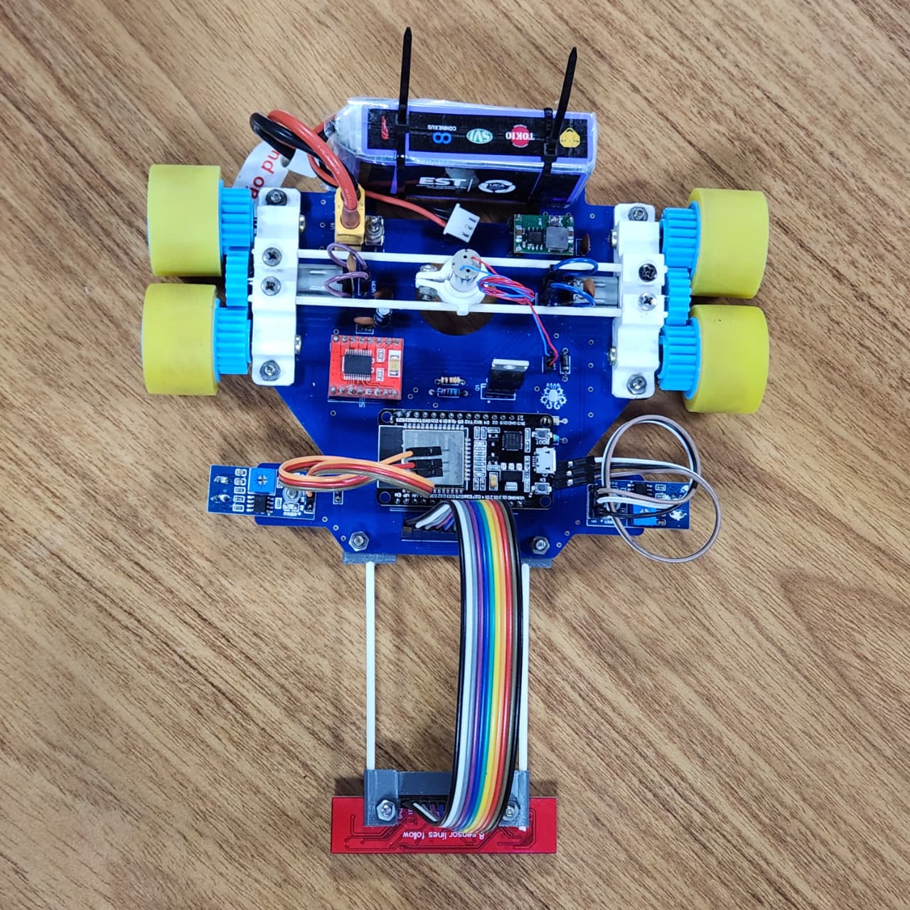

# Diretório de Mecânica

Todos os arquivos relacionados ao projeto mecânico do robô seguidor de linha estão aqui!

---

## Ferramentas Utilizadas

Para o desenvolvimento da mecânica, foi usado o *software* **Autodesk Inventor**.

---

## Estrutura do Diretório

Este diretório contém todos os arquivos relacionados ao projeto mecânico do robô:

- [**`3d_model/`**](./3d_model/): Modelos 3D das peças com versões (V1, V2, etc.)
  - Arquivos CAD 3D e montagem (`.ipt`, `.iam` no Autodesk Inventor)
  
- [**`stl_file/`**](./stl_file/): Arquivos prontos para impressão 3D (`.stl`)
  
- [**`img/`**](./img/): Galeria do projeto
  - Imagens de perspectivas do modelo 3D
  - Fotos da estrutura física montada

---

## Galeria de Imagens

- Visão Geral

- Visão Geral 2

- Visão Traseira

- Visão Superior

