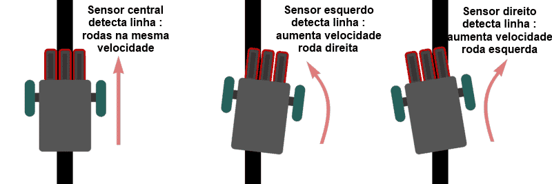

# Estudo - Seguidor de Linha
## Objetivo
- Competir na [**RoboCore Experience**](https://www.robocoreexperience.com/) nas categorias:
	- [Seguidor de Linha Pro](../editais/Regras+-+Seguidor+de+Linha.pdf);
	- [Perseguidor de Linha Pro](../editais/Regras+-+Perseguidor+de+Linha.pdf).
## Visão Geral
* Robôs seguidores de linha são máquinas capazes de percorrer um determinado trajeto através de marcações no chão. Consegue fazer isso graças à presença de sensores que identificam as diferenças de cor ao longo do percurso e informam ao microcontrolador esses dados recolhidos, permitindo que, em conjunto com a lógica de programação ali presente, o robô tome decisões e tenha “conhecimento” do caminho que deve seguir. 

## Resumo do Projeto
O design do projeto a ser desenvolvido está bastante ligado com os robôs de corrida (RobotRace) japoneses, que utilizam motores de alto RPM, vários sensores em array e um sistema de downforce para maior estabilidade. Veja algumas [Inspirações](./inspirações%20e%20referências/Inspirações.md) e equipes brasileiras (que vamos competir contra).
### [Mecânica](./mecânica/Mecânica.md)
- **Chassi:** Integrado na própria PCB (Placa de Circuito Impresso) feito de Fenolite.
- **Tração** (4 Rodas e 2 Motores):
	- 2 Motores N20 (3000 RPM).
	- Sistema de transmissão lateral: 1 motor aciona um conjunto de engrenagens (pinhões) que faz as duas rodas do mesmo lado girarem juntas.
- **Downforce (Turbina):**
	- Turbina customizada feita com motor Coreless (tipo drone) + Hélice impressa. 
	- Fixação direta na PCB.
### [Eletrônica](./eletrônica/Eletrônica.md)
- **Cérebro:** ESP32 (Uso de Dual Core: Controle + Bluetooth).
- **Driver de Motor:** Ponte H TB6612FNG (montada estilo "Shield").
- **Sensores de Pista:** Array QTR-8RC (8 sensores analógicos).
- **Sensores Auxiliares:** Sensores laterais para ler marcas de cruzamento/início de curva (necessário para a lógica de aceleração) e parada.
- **Alimentação:** Bateria LiPo (2S ou 3S - dimensionada para N20, Coreless e ESP).
### [Lógica de controle](./lógica%20de%20controle/Lógica%20de%20controle.md)
- **Controle:** PID Clássico Reativo.
- **Navegação:** Mapeamento simplificado (contagem de marcadores laterais para saber em qual reta/curva está a aplicar a lógica de aceleração em trechos retos)
- **IHC:** Usar o app Serial Bluetooth Terminal para alterar parâmetros (PID, Velocidade Máxima), trocar estados da FSM (Parado, Calibração, Corrida) e alterar estratégias de corrida pré estabelecidas (Conservador, Arriscado).
