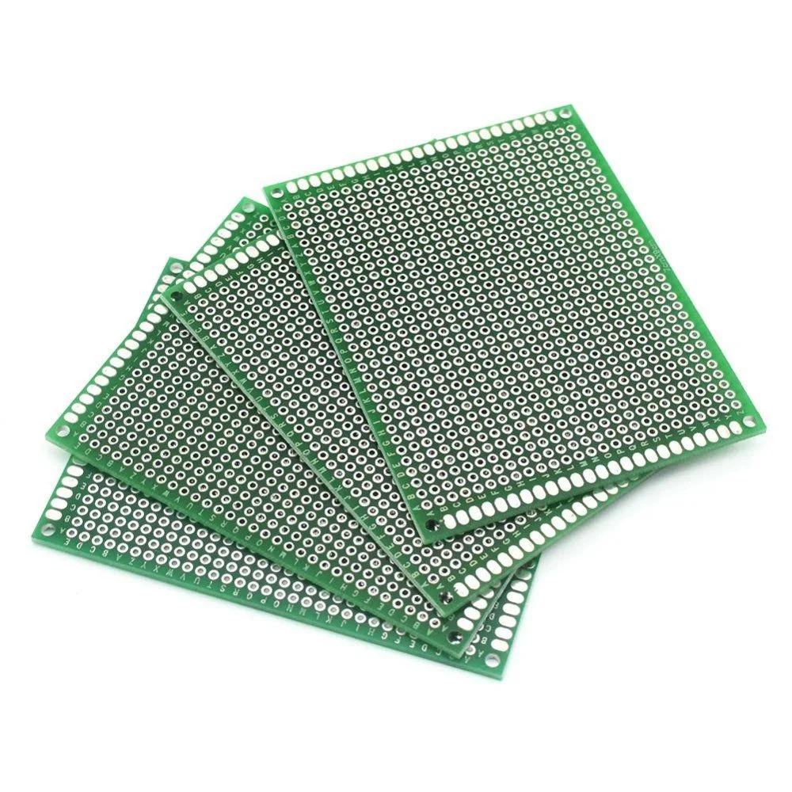
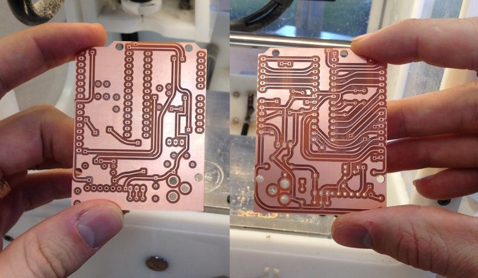
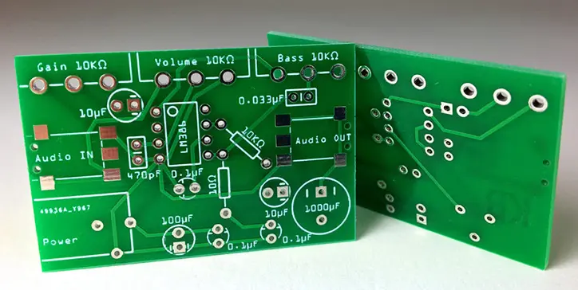

A produção da PCB é essencial para que possamos ter certeza que a eletrônica não falhará e todos os componentes estarão funcionando conforme projetado. Temos algumas abordagens quanto a produção da Placa de Circuito Impresso:
1. **Placa perfurada:** a mais prática e provavelmente será a primeira a ser feita para testes iniciais. 
	- Vantagem: é a mais fácil e rápida de se fazer; 
	- Desvantagem: pode vir com problemas de soldagem, problemas com os jumpers de conexão ou mal dimensionamento de corrente. Além de não ser muito personalizável e flexível quanto à estrutura.
	- Onde fazer: é possível ser feita no próprio laboratório do GEAR

2. **Placa usinada por CNC:** foi a estratégia utilizada no projeto anterior do seguidor de linha 2025, a experiência foi bem satisfatória. 
	- Vantagem: diminui drasticamente o problema da solda e jumper da placa perfurada, permite mais personalização quanto ao formato da placa e dimensionamento das trilhas.
	- Desvantagem: ela tem um nível de complexidade bem mais elevada para ser feita, mas o curso do Ocean de eletrônica ensina a fazer uma placa dessas. É possível também falar com a nossa veterana Natália, visto que ela fez a versão de 2025.
	- Onde fazer: é possível fazer na EST, nos laboratórios do professor Kimura ou do professor Rodrigo

3. **PCB profissional:** o maior desafio técnico e principal diferencial de outras equipes de alto rendimento. Se trata de fazer uma PCB profissional em empresa especializada em SMD.
	- Vantagens: zero problemas com trilhas, dimensionamento, total liberdade de formas e personalização da placa, e são usadas por equipes de competição profissionais.
	- Desvantagens: nível de complexidade extremamente elevado dependendo da abordagem, tempo de entrega e valor do material também pode ser muito custoso. Geralmente as placas chinesas são de maior qualidade, mas poderia ser feito uma pesquisa de outros locais que possam fazer esse tipo de trabalho.

**OBS:** o maior problema de se fazer uma PCB é quanto a pinagem correta dos componentes. Por isso é de extrema importância que o diagrama de Pinout esteja correto e seja feito e revisado detalhadamente.