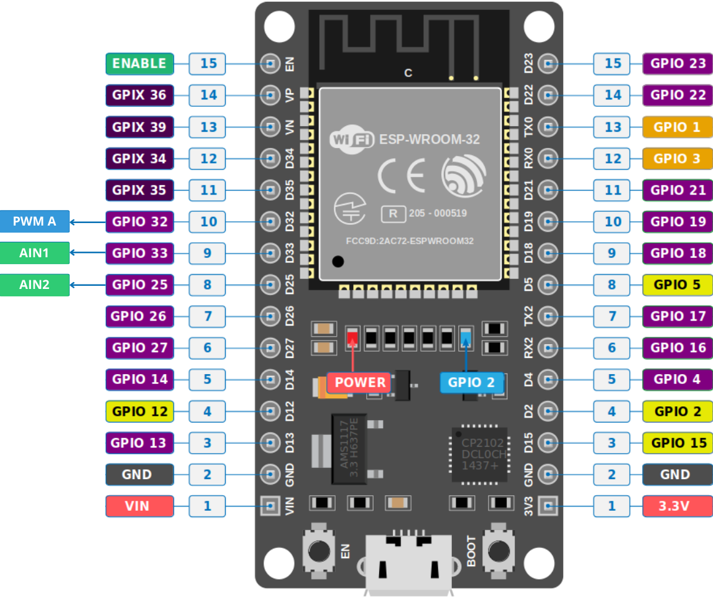
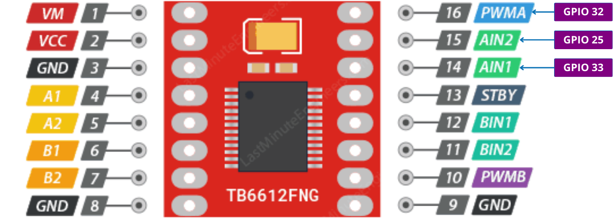

Aqui está um estudo sobre o pinout como deve ser feito o diagrama de Pinout. Deve ser feito para que as constantes sejam definidas na programação e para que fique mais visível e fácil a montagem mecânica. Se possível, colocar uma descrição aos principais pinos e qual a função deles. Exemplo abaixo:

Pinout ESP32:

Pinout TB6612FNG:

***OBS**: neste arquivo vc pode colocar mais informações e estudos sobre o pinout, quais pinos de quais componentes podem ou não ser usados e etc.* 
