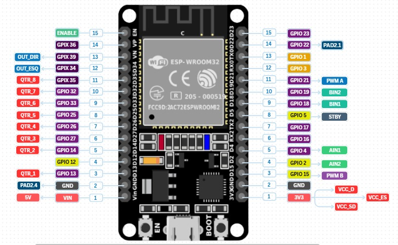
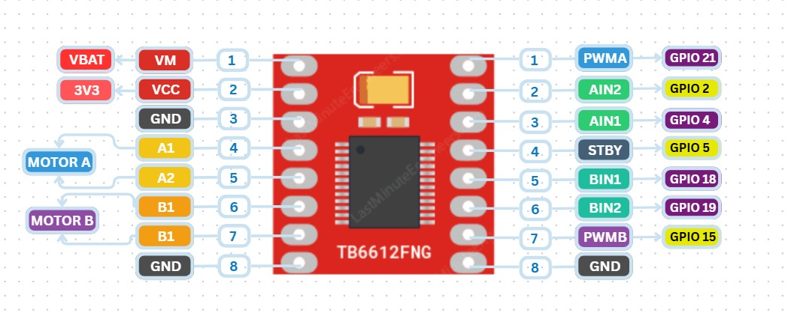
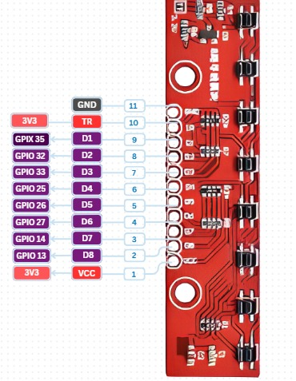
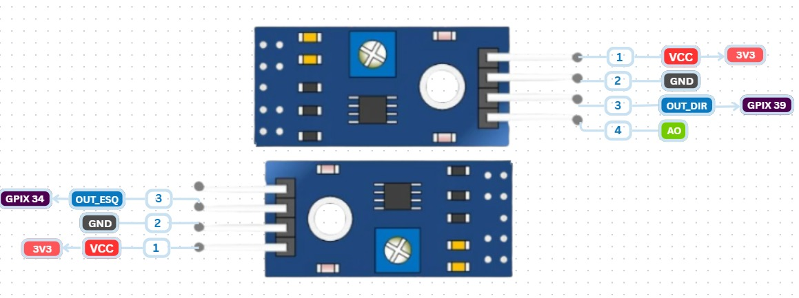
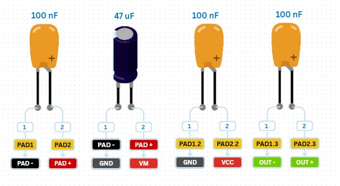
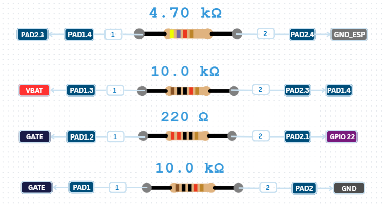

Aqui está um estudo sobre o pinout como deve ser feito o diagrama de Pinout. Deve ser feito para que as constantes sejam definidas na programação e para que fique mais visível e fácil a montagem mecânica. Se possível, colocar uma descrição aos principais pinos e qual a função deles. Exemplo abaixo:

Pinout ESP32:

Pinout TB6612FNG:

Pinout Bateria LiPo 2S 7,4 V 20C 250 mAh:

Pinout Array sensor de linha QTR-8RC:

Pinout TCRT5000:

Pinout Motor N20 3000RPM:

Pinout Motor Coreless 8523 (7,4 V)

Pinout Transistor MOSFET IRLZ44N:

Pinout Diodo 1N4007:

Pinout Chave Switch:

Pinout Capacitores Cerâmicos e eletrolídeos:

Pinout Capacitores de cerâmica dos motores:

Pinout Resistores:

***OBS**: neste arquivo vc pode colocar mais informações e estudos sobre o pinout, quais pinos de quais componentes podem ou não ser usados e etc.* 
