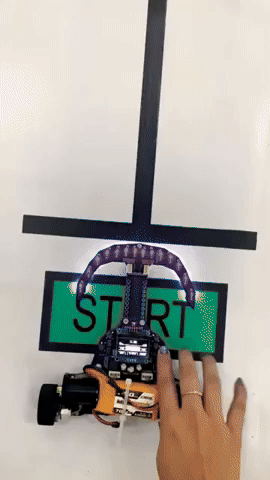
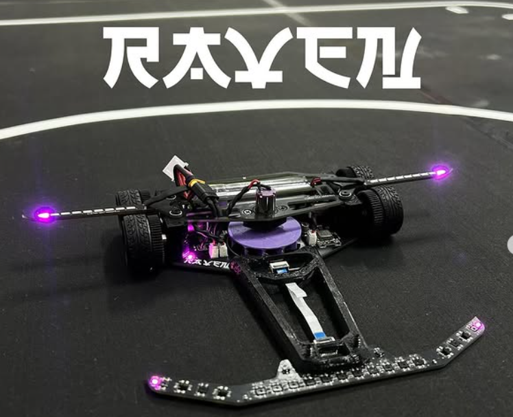
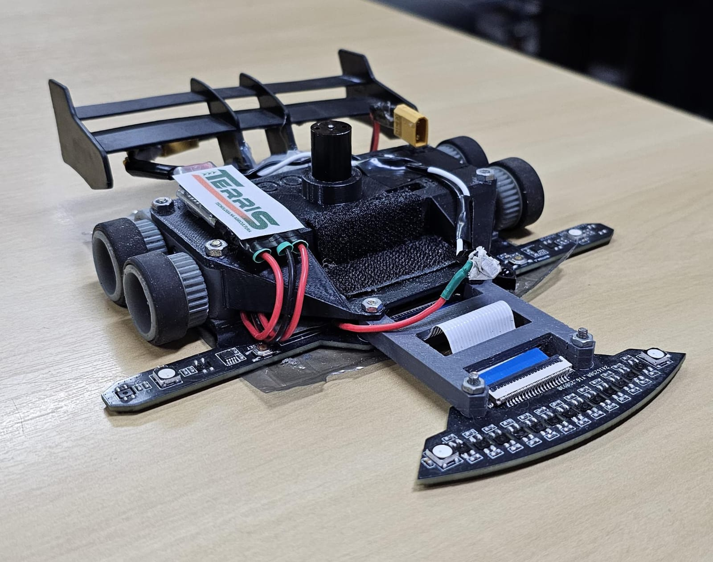
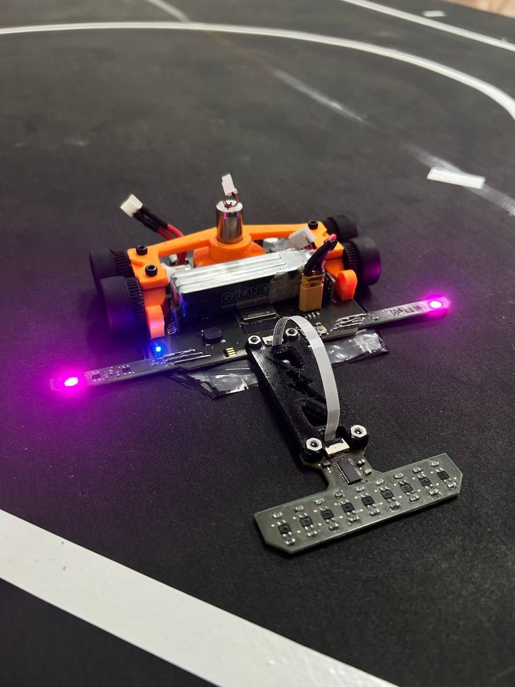
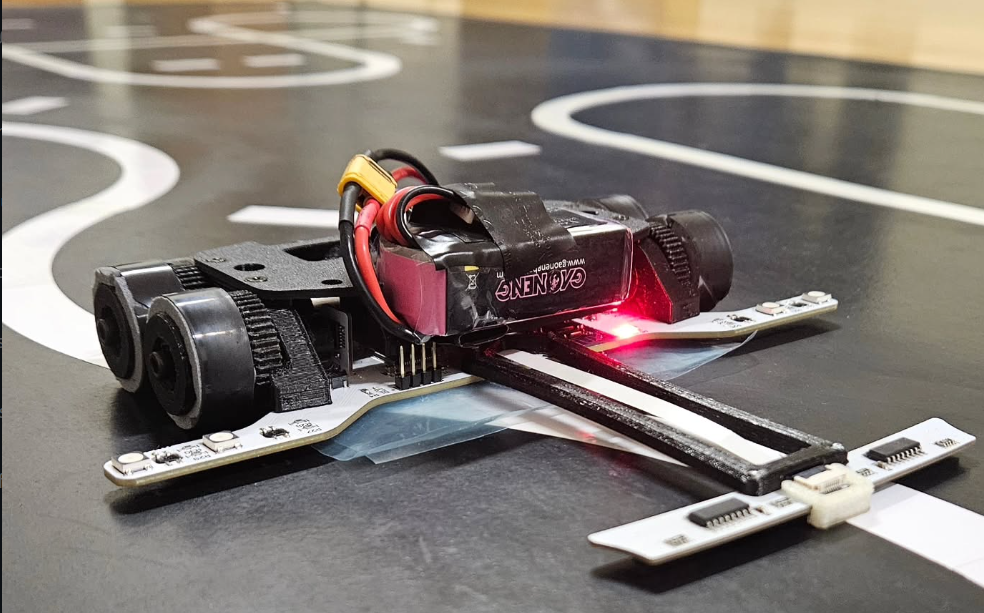
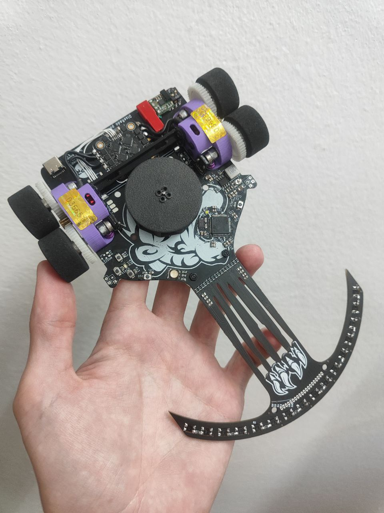

Aqui estão algumas imagens de robotrace japoneses para servir de inspiração para o desenvolvimento do nosso seguidor de linha. Veja também: [Equipes de Referência](./Equipes%20de%20Referência.md), [Outras Referências](./Outras%20Referências.md).

      

      

      

      

      

      

