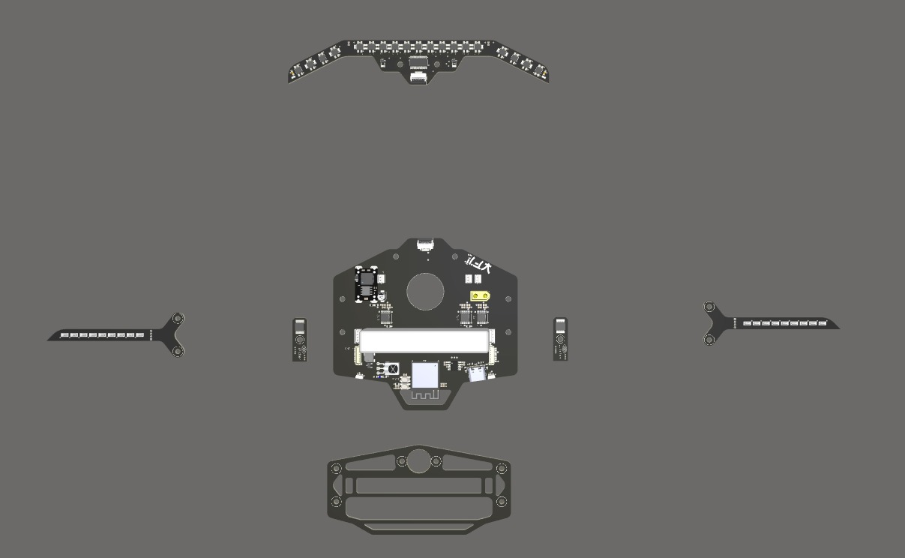
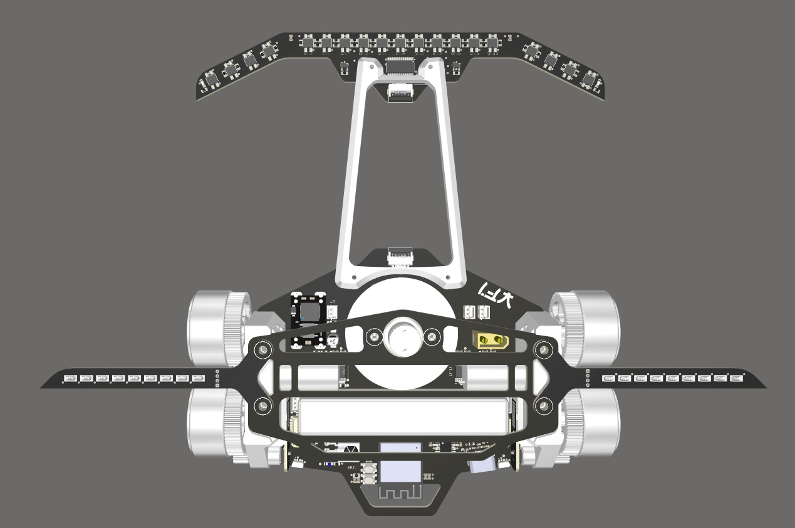

O chassi do Seguidor serve para apoiar a PCB (por vezes o chassi sendo a própria placa), os motores e os sensores na parte da frente. A seguir um modelo "padrão" de um chassi de seguidor de linha/robotrace:

Neste caso da imagem, todas as partes são feitas com placa de circuito impresso e impressão 3D. também com região aberta no meio para a ventoinha de [Downforce](./Downforce.md) e local apropriado para a [Transmissão 4x2](./Transmissão%204x2.md). A montagem (assembly) fica da seguinte forma:

