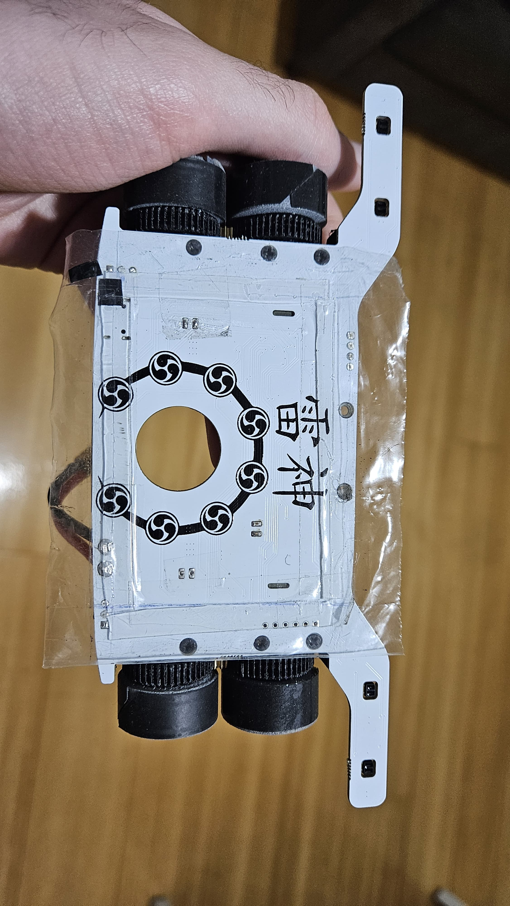
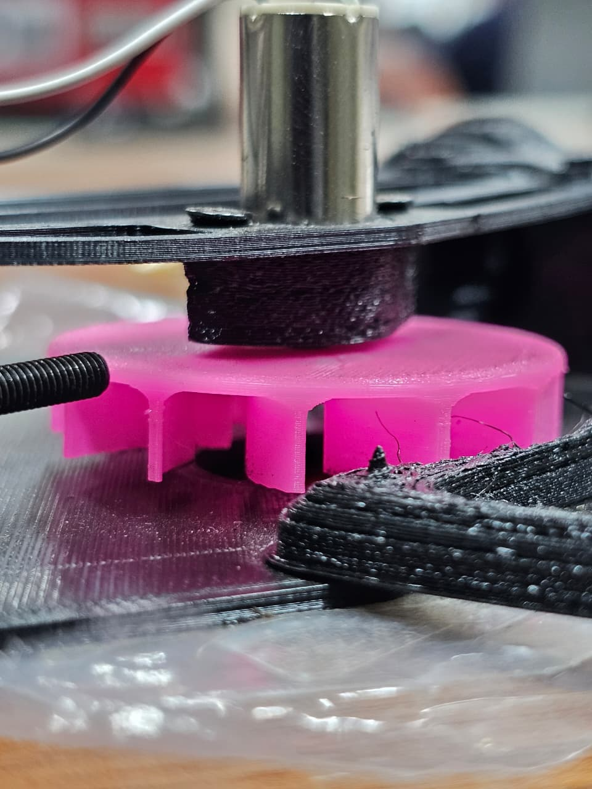

O sistema de downforce serve para aumentar a força normal do robô e, assim, aumentar o atrito entre o chão e as rodas, dessa forma, mantendo maior estabilidade nas curvas em alta velocidade. Funciona basicamente pelo princípio de Bernoulli, em que uma ventoinha é direcionada para retirar o ar da parte de baixo do chassi do robô, gerando uma camada de baixa pressão. Feita a vedação de maneira correta, essa camada de baixa pressão faz com que a camada externa (de maior pressão) empurre o robô para baixo, aumentando assim a força de contato com a superfície (força normal), consequentemente, aumentando o atrito com o chão. A seguir um exemplo desse sistema de sucção feito com motor brushless 1020 e o sistema de vedação das laterais:

Abaixo está um exemplo de turbina que é usada:

Aqui está o link para um vídeo que mostra o funcionamento dele: [video_succao.mp4](../media/img/video_succao.mp4)