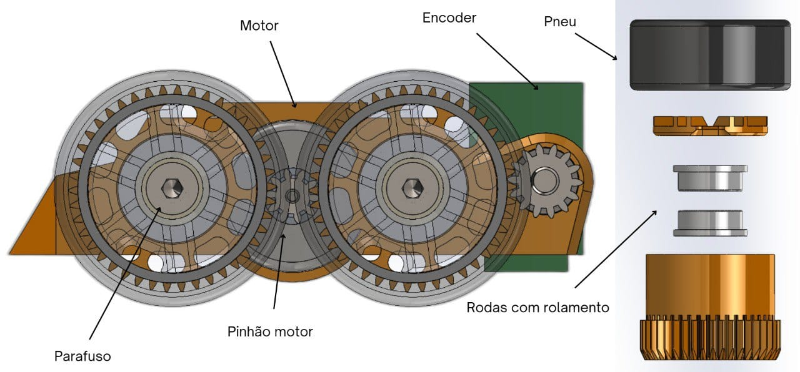
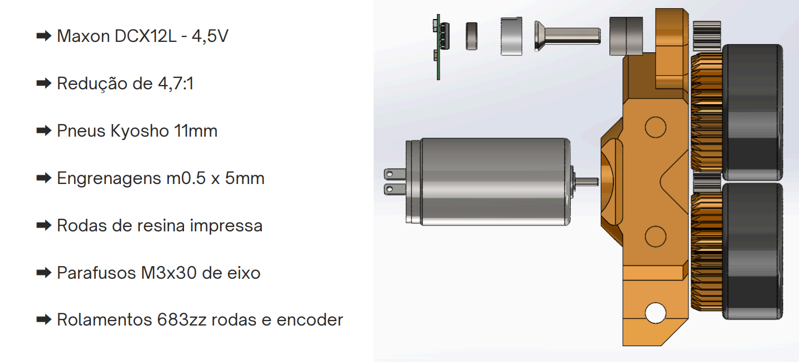
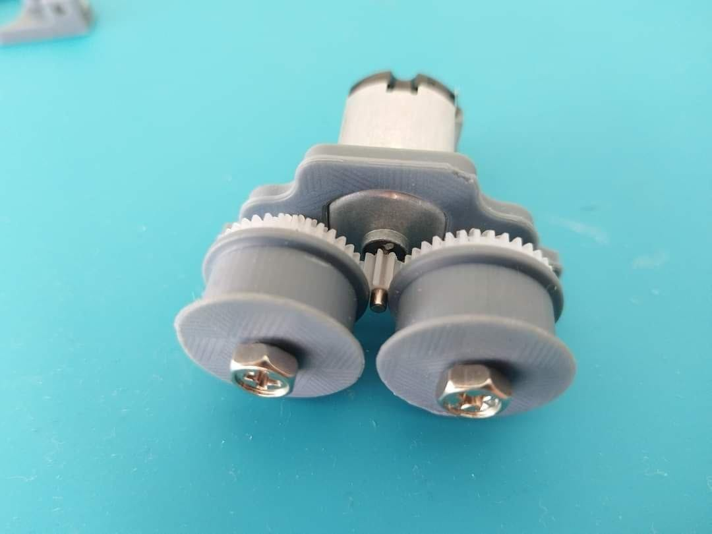

A transmissão 4x2 se trata de uma transmissão de 4 rodas e 2 motores. Os motores são conectados a um pinhão que transmite o movimento em redução com engrenagens para as rodas. Abaixo é possível visualizar como isso ocorre. As vantagens de se utilizar esse sistema de transmissão de movimento é para que o robô tenha mais estabilidade durante as curvas e que tenhamos mais precisão quanto à sua velocidade.

Uma melhor explicação sobre a locomoção do seguidor pode ser vista em [Apresentação_Phoenix.pdf](../media/pdf/Apresentação_Phoenix.pdf).